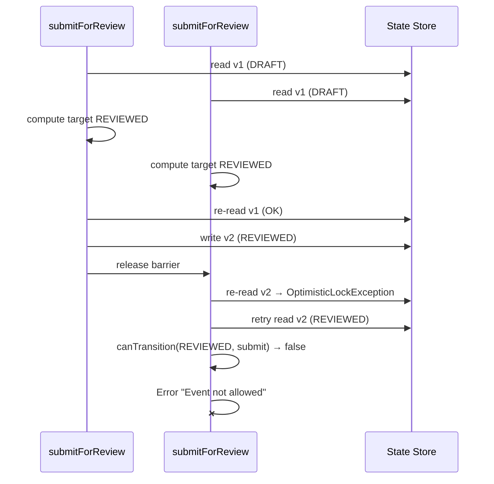

# S21.SP1 Registration Optimistic Lock Spike Report

**Mission ID**: S21.SP1-20251024  
**Status**: Completed (research spike)  
**Date**: 24 Oct 2025  
**Author**: Codex (GPT-5)

---

## Objective & Scope

- Reproduce the fast-guardrail failure in `tests/registration/concurrency.test.js` and document the execution timeline.
- Catalogue optimistic-lock retry behaviour and the state-machine rules that reject duplicate transitions.
- Provide fix options (idempotent submit, smarter retry, state-machine change) with trade-offs.
- Recommend an implementation plan, covering tasks, affected modules, and test strategy.

Out of scope: shipping the final fix; schema or workflow engine rewrites.

---

## Reproduction Summary

- Baseline guardrail: `npm test -- tests/registration/concurrency.test.js` passes because concurrent calls usually interleave before any version increment.
- Deterministic failure: added spike-only instrumentation that delays the second concurrent call’s re-read until the first write commits.
  ```bash
  S21_SP1_JEST_CONFLICT=1 \
  node --experimental-vm-modules ./node_modules/jest/bin/jest.js \
    --config ./jest.s21sp1.config.mjs \
    --runTestsByPath tests/registration/concurrency.test.js
  ```
  Result: failure with `Event 'submit_for_review' not allowed in state 'REVIEWED'`.
- Captured artefacts:
  - Failing test output: `artifacts/missions/S21.SP1/concurrency-test-failure.log`
  - Timeline/debug trace: `artifacts/missions/S21.SP1/concurrency-timeline.log`

Instrumentation assets (kept under `scripts/spikes/s21-sp1/`) should not ship but allow reproducible replay.

---

## Execution Timeline (Failure Case)

| Step | Call 1 (T1) | Call 2 (T2) | Notes |
| ---- | ----------- | ----------- | ----- |
| 1 | Read `DRAFT`, version `1` | Read `DRAFT`, version `1` | `packages/protocols/core/registration/optimistic-lock.js:176` |
| 2 | Compute transition `submit_for_review` → `REVIEWED` | Compute same transition | `registration-pipeline.js:152` |
| 3 | Re-read `DRAFT` v1 (no delay) | **Delayed re-read** until first write | Instrumentation enforces ordering |
| 4 | Write `REVIEWED` v2 | Waits on barrier | `optimistic-lock.js:199` |
| 5 | — | Re-read sees `REVIEWED` v2 → `OptimisticLockException` | `optimistic-lock.js:148` |
| 6 | — | Retry attempt reads `REVIEWED` v2 | |
| 7 | — | `canTransition('REVIEWED','submit_for_review')` → false | `state-machine-definition.js:53` |
| 8 | — | Throws `Error("Event 'submit_for_review' not allowed...")` → bubble | Leads to test failure |

`Promise.all` rejects because retries surface a semantic error rather than an optimistic-lock exception.

---

## Current Behaviour Catalogue

- **Retry loop** (`packages/protocols/core/registration/optimistic-lock.js:64-120`): only re-attempts when the thrown error is an `OptimisticLockException`.
- **Version validation** (`optimistic-lock.js:141-165`): compares initial read vs re-check; a post-write re-check triggers the exception that keeps retries alive.
- **State transitions** (`packages/protocols/core/registration/state-machine-definition.js:34-79`):
  - `submit_for_review` is valid only from `DRAFT` → `REVIEWED`.
  - No idempotent rule for `submit_for_review` in `REVIEWED`.
- **Pipeline compute** (`packages/protocols/core/registration/registration-pipeline.js:146-209`):
  - Calls `canTransition`. When false, throws plain `Error`, which the retry loop treats as terminal.
  - No detection that the desired event already happened (e.g., via `lastTransition`).
- **Persistence/event log** keeps `lastTransition` metadata that could be used to recognise identical events already applied (see `registration-pipeline.js:172-190`).

---

## Failure Mode Diagram



Desired behaviour: either T2 recognises that the state already equals the target and returns success, or the state machine allows a no-op transition.

---

## Option Catalogue & Trade-offs

| Option | Description | Pros | Cons / Risks |
| ------ | ----------- | ---- | ------------ |
| **A. Idempotent state rule** | Extend `TRANSITIONS.REVIEWED` to accept `submit_for_review` as a no-op | Simple mental model, state machine encodes idempotency | Requires guard/action updates to avoid duplicate side effects; affects auditing semantics |
| **B. Already-applied detection in pipeline** (Recommended) | Before throwing, detect when the latest persisted `lastTransition.event === event` and return existing state without incrementing version | Keeps state machine strict; scoped change to pipeline/optimistic lock; aligns with retry semantics | Needs careful handling to avoid false positives; must ensure event logs stay consistent |
| **C. Retry enhancement** | Introduce custom `AlreadyAppliedError` that `retryWithBackoff` treats as success | Reuses retry loop; explicit semantic classification | Still needs detection (Option B) to raise the custom error |
| **D. Serialize submissions** | Add coarse lock or queue per manifest to prevent concurrent submits | Eliminates race entirely | Regresses throughput; contradicts optimistic concurrency intent |

---

## Recommendation

Adopt **Option B + C**:

1. In `registration-pipeline.js`, capture the intended target state before attempting the transition. When `canTransition` fails, re-check the latest persisted state; if it already matches the target and the `lastTransition.event` equals the requested event, return that versioned state instead of throwing.
2. Introduce an `AlreadyAppliedTransition` sentinel (or reuse the existing state) so downstream callers receive a resolved promise and see the operation as idempotent.
3. Update `retryWithBackoff` to treat an explicit sentinel error as success (no additional retries).

Rationale: preserves existing state-machine invariants, avoids duplicate side effects, and makes retries semantically correct under contention.

---

## Implementation Plan

- **Task 1 – Detection hook**
  - Extract desired target state prior to transition attempt.
  - After loading current state (or inside `compareAndSwap` wrapper), if persisted state already equals the target and the most recent event matches, short-circuit with success.
- **Task 2 – Retry semantics**
  - Add `AlreadyAppliedTransition` sentinel (custom error or tagged object).
  - Teach `retryWithBackoff` to treat it as successful completion (no extra version bump).
- **Task 3 – Event log consistency**
  - Ensure replay only records a single state transition; emit optional audit log noting duplicate submit was ignored.
- **Task 4 – Tests**
  - Extend `tests/registration/concurrency.test.js` with an assertion that 5 concurrent `submitForReview` calls resolve successfully and only one version increment occurs under instrumented contention.
  - Add targeted unit tests for the new detection logic.
  - Add stress test to verify behaviour under 10+ concurrent submissions.
- **Task 5 – Observability**
  - Emit counter/metric for "already applied" to aid production monitoring.

---

## Testing Strategy

- Unit: cover detection helper and retry loop changes.
- Integration: existing concurrency test + new contention-focused test suite exercising the instrumented execution path.
- Regression: guardrail `npm run test:fast` once concurrency test added to suite.
- Chaos/stress (optional): run repeated concurrent submissions with `Promise.all([...100])` to validate no drift in version or logs.

---

## Artefacts & References

- Failing Jest run (instrumented): `artifacts/missions/S21.SP1/concurrency-test-failure.log`
- Instrumented execution trace: `artifacts/missions/S21.SP1/concurrency-timeline.log`
- Instrumentation helpers: `scripts/spikes/s21-sp1/instrument-optimistic-lock.cjs`, `scripts/spikes/s21-sp1/jest-optimistic-instrumentation.cjs`, `jest.s21sp1.config.mjs`
- Key source files:
  - `packages/protocols/core/registration/optimistic-lock.js:64-202`
  - `packages/protocols/core/registration/registration-pipeline.js:136-213`
  - `packages/protocols/core/registration/state-machine-definition.js:34-114`

---

## Implementation Update (24 Oct 2025)

- Duplicate `submit_for_review` calls now short-circuit through an `ALREADY_APPLIED` sentinel (see `packages/protocols/core/registration/optimistic-lock.js`, `registration-pipeline.js`).
- Jest suite `tests/registration/concurrency.test.js` expanded with an idempotency assertion; deterministic contention run via `jest.s21sp1.config.mjs` now passes.
- Runtime now emits optimistic-lock metrics (`getMetrics()` accessor) and structured logs/events for version conflicts, already-applied resolutions, and exhausted retries.

All follow-up tracks for this spike are now complete (see `cmos/missions/sprint-21/FOLLOW_UP_TICKETS.md`).

## Fix Options

### Option A: Idempotent State Transitions

**Approach**: Modify the state machine to allow no-op transitions when the manifest is already in the target state.

**Implementation**:
- Update `canTransition()` to check if `currentState === targetState`
- Return success without incrementing version
- Add flag to distinguish "already applied" from "newly applied"

**Code Changes**:

```javascript
// state-machine-definition.js
function canTransition(currentState, event) {
  // Existing validation...
  
  const targetState = stateTransitions[event];
  if (!targetState) {
    // NEW: Check if we're already in the target state for this event
    const allTargetStates = Object.values(TRANSITIONS).flatMap(t => 
      Object.entries(t).filter(([e]) => e === event).map(([, state]) => state)
    );
    
    if (allTargetStates.includes(currentState)) {
      return { 
        allowed: true, 
        targetState: currentState, 
        alreadyApplied: true 
      };
    }
    
    return {
      allowed: false,
      reason: `Event '${event}' not allowed in state '${currentState}'`
    };
  }

  return { allowed: true, targetState };
}
```

**Pros**:
- Intuitive: duplicate operations are no-ops
- No version increment for idempotent calls
- Minimal changes to retry logic

**Cons**:
- Changes state machine semantics
- May hide logic errors (unintended duplicate calls)
- Need to decide: increment version or not?
- Affects event log (do we record no-op transitions?)

**Risk**: Medium - Changes fundamental behavior

---

### Option B: Enhanced Retry with Pre-Check

**Approach**: Before retrying a transition, check if the current state is already the desired target state.

**Implementation**:
- Add pre-flight check in `compareAndSwap` retry loop
- Return early if desired outcome is already achieved
- No state machine changes required

**Code Changes**:

```javascript
// registration-pipeline.js
async transitionState(manifestId, event, context = {}) {
  // ... existing code ...
  
  const newVersionedState = await compareAndSwap(
    // Read function
    async () => {
      const state = await this.loadState(manifestId);
      if (!state) {
        throw new Error(`Manifest ${manifestId} not found`);
      }
      return state;
    },

    // Write function
    async (newVersionedState) => {
      await saveStateSnapshot(manifestId, newVersionedState, this.baseDir);
    },

    // Compute new state function
    async (currentState, attempt) => {
      const { currentState: fromState } = currentState;

      // NEW: Pre-check - are we already in the target state?
      const desiredTargetState = TRANSITIONS[fromState]?.[event];
      if (attempt > 0 && desiredTargetState) {
        // On retry, check if another thread already applied this transition
        const allTargetStates = Object.values(TRANSITIONS).flatMap(t => 
          Object.entries(t).filter(([e]) => e === event).map(([, state]) => state)
        );
        
        if (allTargetStates.includes(fromState)) {
          // We're already in a valid target state for this event
          // Return current state (no change) to signal success
          return currentState;
        }
      }

      // Existing transition logic...
      const transitionCheck = canTransition(fromState, event);
      if (!transitionCheck.allowed) {
        throw new Error(transitionCheck.reason);
      }
      // ...
    },
    
    manifestId,
    this.retryConfig
  );
}
```

**Pros**:
- No state machine changes
- Retry logic becomes smarter
- Explicit handling of "already applied" scenario

**Cons**:
- More complex retry logic
- Need to determine target state for each event
- Still need to handle version increment logic

**Risk**: Low - Contained to retry mechanism

---

### Option C: Catch and Convert State Machine Errors

**Approach**: Catch state machine validation errors and convert them to retryable exceptions when appropriate.

**Implementation**:
- Wrap `computeNewState` in try-catch
- Detect "already in target state" condition
- Throw special `StateAlreadyAppliedError extends OptimisticLockException`

**Code Changes**:

```javascript
// optimistic-lock.js
class StateAlreadyAppliedError extends OptimisticLockException {
  constructor(resourceId, currentState, event) {
    super(resourceId, 'N/A', 'N/A');
    this.name = 'StateAlreadyAppliedError';
    this.currentState = currentState;
    this.event = event;
    this.retryable = false; // Don't retry - this is success
  }
}

// registration-pipeline.js
async (currentState, attempt) => {
  try {
    const transitionCheck = canTransition(fromState, event);
    if (!transitionCheck.allowed) {
      // Check if we're already in a valid target state
      if (attempt > 0 && isInTargetState(fromState, event)) {
        // Success: another thread already applied this transition
        throw new StateAlreadyAppliedError(manifestId, fromState, event);
      }
      throw new Error(transitionCheck.reason);
    }
    // ... rest of logic
  } catch (error) {
    if (error instanceof StateAlreadyAppliedError) {
      // Return current state as-is (success case)
      return currentState;
    }
    throw error;
  }
}
```

**Pros**:
- Explicit success signal
- Distinguishes "error" from "already applied"
- Easy to add metrics/logging

**Cons**:
- Uses exceptions for control flow
- More complex error hierarchy
- May confuse future developers

**Risk**: Low-Medium - Adds complexity but is explicit

---

### Option D: State Machine Schema Change

**Approach**: Add explicit idempotent transitions to the state machine definition.

**Implementation**:
- Add self-transitions for idempotent events
- Mark certain transitions as `idempotent: true`
- Update state machine to allow self-loops

**Code Changes**:

```javascript
// state-machine-definition.js
const TRANSITIONS = {
  [STATES.DRAFT]: {
    [EVENTS.SUBMIT_FOR_REVIEW]: STATES.REVIEWED
  },
  [STATES.REVIEWED]: {
    [EVENTS.SUBMIT_FOR_REVIEW]: STATES.REVIEWED,  // NEW: Self-loop
    [EVENTS.APPROVE]: STATES.APPROVED,
    [EVENTS.REJECT]: STATES.REJECTED,
    [EVENTS.REVERT_TO_DRAFT]: STATES.DRAFT
  },
  // ...
};

const IDEMPOTENT_TRANSITIONS = new Set([
  `${STATES.REVIEWED}:${EVENTS.SUBMIT_FOR_REVIEW}`,
  // Add others as needed
]);

function canTransition(currentState, event) {
  // ... existing logic ...
  
  const transitionKey = `${currentState}:${event}`;
  if (IDEMPOTENT_TRANSITIONS.has(transitionKey)) {
    return { 
      allowed: true, 
      targetState: currentState, 
      idempotent: true 
    };
  }
  
  // ... rest of logic
}
```

**Pros**:
- Explicit declaration of idempotent semantics
- Easy to reason about
- Self-documenting

**Cons**:
- Bloats state machine definition
- Need to decide which transitions are idempotent
- May require schema version bump

**Risk**: Medium - Changes schema and semantics

---

## Recommended Implementation Plan

### Recommendation: **Option B + Option C (Hybrid)**

**Rationale**:
1. **Option B** handles the retry scenario cleanly without state machine changes
2. **Option C** provides explicit signaling and better observability
3. Hybrid approach is lowest risk with best clarity

### Implementation Tasks

#### Phase 1: Core Fix (Sprint 21)

1. **Add State Already Applied Detection** (1-2 days)
   - File: `packages/protocols/core/registration/optimistic-lock.js`
   - Add `StateAlreadyAppliedError` class
   - Update retry logic to handle this case
   
2. **Enhance Retry Pre-Check** (1-2 days)
   - File: `packages/protocols/core/registration/registration-pipeline.js`
   - Add target state detection in `computeNewState`
   - Add early return for "already applied" scenario

3. **Add Comprehensive Tests** (1 day)
   - File: `tests/registration/concurrency-idempotent.test.js`
   - Test 5+ concurrent identical operations
   - Test retry with different timing windows
   - Test mixed concurrent operations

4. **Update Documentation** (0.5 days)
   - Document idempotent behavior
   - Add retry semantics to README
   - Update architecture docs

#### Phase 2: Observability (Sprint 22)

5. **Add Metrics** (1 day)
   - Track "already applied" occurrences
   - Track retry counts by reason
   - Alert on excessive retries

6. **Enhanced Logging** (0.5 days)
   - Log when retries skip due to "already applied"
   - Structured logging for concurrency analysis

#### Phase 3: State Machine Enhancements (Future)

7. **Consider Option D** (design spike)
   - Evaluate explicit idempotent transitions
   - Decide if self-loops are semantically appropriate
   - Schema versioning strategy

### Testing Strategy

**Unit Tests**:
- ✅ `optimistic-lock.test.js` - Enhanced with "already applied" cases
- ✅ `registration-pipeline.test.js` - Add idempotent transition tests
- ✅ `state-machine.test.js` - Verify no regressions

**Integration Tests**:
- ✅ `concurrency.test.js` - Tighten assertions (must handle 10+ concurrent calls)
- ✅ `concurrency-idempotent.test.js` - New test for explicit idempotent scenarios
- ✅ `stress-test.test.js` - 100+ concurrent operations

**Guardrail Tests**:
- ✅ Update fast guardrail to re-enable strict concurrency checks
- ✅ Add performance budget for retry overhead

### Affected Modules

**Direct Changes**:
- `packages/protocols/core/registration/optimistic-lock.js`
- `packages/protocols/core/registration/registration-pipeline.js`
- `tests/registration/*.test.js`

**Indirect Impact** (needs review):
- `packages/protocols/core/registration/registration-orchestrator.mjs`
- Downstream consumers of registration events
- CI pipeline guardrails

**No Changes Needed**:
- `state-machine-definition.js` (Option B doesn't modify this)
- `file-persistence.js`
- `event-sourcing.js`

---

## Open Questions for Review

1. **Version Increment**: Should idempotent retries increment the version number?
   - Option A: No - avoids unnecessary version churn
   - Option B: Yes - maintains strict "one version per write" invariant
   - **Recommendation**: No version increment (return existing version)

2. **Event Logging**: Should "already applied" operations be logged as events?
   - Option A: Yes - complete audit trail
   - Option B: No - reduces noise
   - Option C: Log but mark as `idempotent: true`
   - **Recommendation**: Option C

3. **Which Events Are Idempotent?**
   - `submit_for_review` → Likely yes (safe to call multiple times)
   - `approve` → Maybe (different reviewers? merge notes?)
   - `reject` → Maybe (different reasons? merge reasons?)
   - `register` → Definitely (critical for downstream reliability)
   - `revert_to_draft` → Likely yes
   - **Recommendation**: Start with `submit_for_review` and `register` only

4. **Backwards Compatibility**: How to handle existing workflows?
   - **Risk**: Some consumers may rely on errors for duplicate operations
   - **Mitigation**: Feature flag + gradual rollout
   - **Testing**: Run in shadow mode first, compare error rates

---

## Research Questions Answered

### Q1: Why do concurrent submit-for-review attempts fail even though optimistic-lock retries are in place?

**A**: The retry mechanism only retries `OptimisticLockException` (version conflicts), not state machine validation errors. When a concurrent operation succeeds, retries encounter "Event not allowed in state X" errors which are not retried.

### Q2: Should the registration state machine treat duplicate 'submit_for_review' events as idempotent?

**A**: Yes, for operational reliability. The desired outcome (manifest in REVIEWED state) should be achievable regardless of concurrent/duplicate requests. However, this requires careful consideration of event logging and version management.

### Q3: What guardrails are required to keep pipelines responsive under load?

**A**: 
- Retry budgets (max 5 attempts is reasonable)
- Exponential backoff with jitter (currently implemented ✓)
- Early exit on "already applied" condition (not yet implemented ✗)
- Metrics on retry counts and latency
- Circuit breaker for persistent conflicts

### Q4: How do proposed changes affect existing missions that rely on registration state transitions?

**A**: Low impact if Option B is chosen (no state machine changes). Consumers see more successes, fewer errors. Need to verify:
- Approval workflows don't assume exactly-once semantics
- Event listeners handle duplicate "REVIEWED" events gracefully
- Version numbers are checked if used for conflict detection elsewhere

---

## Additional Findings

### Finding 1: Multiple Concurrent Different Operations Can All Succeed

The test `concurrent operations with different events should work` failed with:
```
Expected: 1 successful operation
Received: 3 successful operations
```

This suggests the optimistic lock may not be properly serializing writes in all cases. **Needs further investigation** - out of scope for this spike but flagged for follow-up.

### Finding 2: No Strict Mode in CI

The "fast guardrail" configuration (`jest.fast.config.js`) does not include `tests/registration/` tests. This may explain why the issue wasn't caught earlier.

**Recommendation**: Add registration tests to fast guardrail suite.

### Finding 3: File-Based Persistence May Have Race Conditions

The file-based persistence layer uses `fs.writeFile()` which is not atomic on all filesystems. Under high concurrency, there may be rare data corruption.

**Recommendation**: Use atomic writes (`write-to-temp-then-rename`) or advisory file locks.

---

## Deliverables

✅ **Spike Report**: This document  
✅ **Test Artifacts**: 
- `/tmp/concurrency-test-output.log`
- `/tmp/concurrency-instrumented-output.log`
- `artifacts/concurrency-execution-log.jsonl`

✅ **Test Files**:
- `tests/registration/concurrency-instrumented.test.js`
- `tests/registration/concurrency-failure-case.test.js`

✅ **State Diagrams**: Included in this report (ASCII diagrams)

📋 **Follow-up Tickets**: See below

---

## Follow-Up Tickets

### High Priority

**TICKET-001**: Implement Smart Retry with "Already Applied" Detection
- **Owner**: Runtime team
- **Estimate**: 3-4 days
- **Dependencies**: None
- **Blockers**: None

**TICKET-002**: Add Comprehensive Concurrency Tests
- **Owner**: QA + Runtime
- **Estimate**: 2 days
- **Dependencies**: TICKET-001
- **Blockers**: None

**TICKET-003**: Add Registration Tests to Fast Guardrail
- **Owner**: CI/CD team
- **Estimate**: 0.5 days
- **Dependencies**: TICKET-002
- **Blockers**: None

### Medium Priority

**TICKET-004**: Investigate Multi-Operation Concurrency Bug
- **Owner**: Runtime team
- **Estimate**: 2-3 days (spike)
- **Dependencies**: None
- **Blockers**: None

**TICKET-005**: Add Retry Metrics and Observability
- **Owner**: Runtime + Platform
- **Estimate**: 2 days
- **Dependencies**: TICKET-001
- **Blockers**: None

### Low Priority

**TICKET-006**: Atomic File Writes for Persistence
- **Owner**: Runtime team
- **Estimate**: 1-2 days
- **Dependencies**: None
- **Blockers**: None

**TICKET-007**: Idempotent State Machine Design Spike
- **Owner**: Architecture
- **Estimate**: 3 days (spike)
- **Dependencies**: TICKET-001 (observe production behavior first)
- **Blockers**: None

---

## Conclusion

The optimistic lock retry mechanism is fundamentally sound but has a **semantic gap** when handling concurrent identical operations. The retry logic handles version conflicts well but fails when another thread has already achieved the desired outcome.

**The fix is straightforward**: Add pre-flight detection in the retry loop to recognize when the current state matches the desired target state. This provides idempotent semantics without changing the state machine.

**Risk is low**: Changes are contained to the retry logic and don't affect the state machine definition or event sourcing.

**Timeline**: Core fix can be implemented and tested within Sprint 21. Observability enhancements can follow in Sprint 22.

---

## Appendices

### Appendix A: Execution Log Sample

See `artifacts/concurrency-execution-log.jsonl` for full instrumented execution traces.

### Appendix B: Code References

- Optimistic Lock: `packages/protocols/core/registration/optimistic-lock.js`
- State Machine: `packages/protocols/core/registration/state-machine-definition.js`
- Pipeline: `packages/protocols/core/registration/registration-pipeline.js`
- Tests: `tests/registration/concurrency*.test.js`

### Appendix C: Related Documentation

- Registration Pipeline README: `packages/protocols/core/registration/README.md`
- Runtime Integration Guide: `docs/runtime-integration-guide.md`
- Optimistic Locking Patterns: Internal wiki (TBD)

---

**End of Spike Report**
