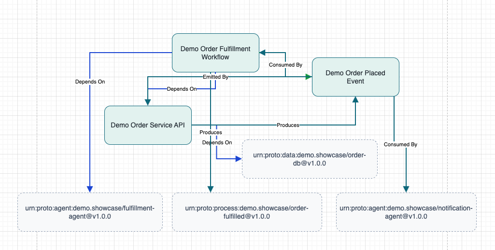

# Demo Showcase Walkthrough

This guide captures the exact steps used to assemble the curated order-fulfillment showcase and verify the import → validate → visualize loop end to end. Follow the commands below to reproduce the demo without guesswork.

## Outcome Snapshot
- Validated manifests copied into `artifacts/catalogs/showcase/`
- Canonical graph written to `artifacts/graphs/showcase/catalog-graph.json`
- Draw.io diagram exported to `artifacts/diagrams/showcase.drawio`
- Guardrail warnings documented so presenters can address styling gaps



## Prerequisites
- Node 18+
- Repository dependencies installed (`npm install`)
- Clean working directory (script overwrites `artifacts/catalogs/showcase/*`)
- Optional: [`jq`](https://stedolan.github.io/jq/) for quick JSON filtering in later steps

## Step 1 — Confirm Curated Manifests
Ensure the three curated manifests from Sprint 23 exist under `approved/`:

| Manifest | URN | Path |
| --- | --- | --- |
| Demo Order Service API | `urn:proto:api:demo.showcase/order-api@v1.0.0` | `approved/demo-api/manifest.json` |
| Demo Order Placed Event | `urn:proto:event:demo.showcase/order-placed@v1.0.0` | `approved/demo-event/manifest.json` |
| Demo Order Fulfillment Workflow | `urn:proto:workflow:demo.showcase/order-fulfillment@v1.0.0` | `approved/demo-workflow/manifest.json` |

Each file includes provenance metadata that traces back to the seeds captured in missions B23.1 and B23.2.

## Step 2 — Run the Showcase Pipeline
Kick off the automation script from the workspace root:

```bash
node scripts/demo/run-showcase.mjs --overwrite
```

Expected console output (trimmed for brevity):

```
Workspace: /Users/d/portfolio/OSSP-AGI
Showcase manifests: /Users/d/portfolio/OSSP-AGI/artifacts/catalogs/showcase
✔ Showcase pipeline completed
  Manifests copied: 3
  Graph nodes: 7
  Graph edges: 10
  Graph output: /Users/d/portfolio/OSSP-AGI/artifacts/graphs/showcase/catalog-graph.json
  Diagram output: /Users/d/portfolio/OSSP-AGI/artifacts/diagrams/showcase.drawio
Protocols discovered:
  - Demo Order Service API [api]
  - Demo Order Fulfillment Workflow [workflow]
  - Demo Order Placed Event [event]
⚠ Diagram guardrails
  No explicit node style for type "api", falling back to defaults.
  ...
```

Use `--dry-run` if you want to verify manifest availability without writing artifacts.

## Step 3 — Inspect the Generated Artifacts
- `artifacts/catalogs/showcase/` now contains the curated manifests copied with showcase-friendly filenames.
- `artifacts/graphs/showcase/catalog-graph.json` holds the canonical graph (nodes: 7, edges: 10).
- `artifacts/diagrams/showcase.drawio` stores the Draw.io diagram. To view it:
  1. Visit [https://app.diagrams.net/](https://app.diagrams.net/) (no account required).
  2. When prompted for a storage location, choose **Device** and click **Create**; this opens a blank canvas.
  3. Use **File → Open from → Device…** and pick `artifacts/diagrams/showcase.drawio`.
  4. Zoom or pan until the API → Event → Workflow chain fills the frame.
- Capture the screenshot from that diagrams.net canvas once the three primary nodes are visible. (You can also launch the local viewer with `npm run cli -- ui` and filter for `demo.showcase` URNs if you prefer a browser-native view; either surface shows the same relationships.)

To enumerate just the curated protocols in the catalog:

```bash
node cli/index.js catalog list --workspace . --format json \\
  | jq '[.[] | select(.urn | test(\"^urn:proto:(api|event|workflow):demo\\\\.showcase/\"))]'
```

The command should emit three entries matching the URNs listed above, with edges linking API → Event → Workflow.

## Step 4 — Present the Story
1. Open the diagram in diagrams.net and highlight the API → Event → Workflow chain.
2. (Optional) Launch the viewer with `npm run cli -- ui` to browse the same story in the browser. The command should log “Authoring UI running at http://localhost:3030” and stay open until you press `Ctrl+C`; if the log never appears, skip this step and rely on the diagram screenshot instead.
3. Call out the guardrail warnings from the pipeline output; they document the styling gaps we plan to address next.

## Troubleshooting
- **Missing manifest error**: Re-run mission B23.1/B23.2 steps to regenerate the curated manifests under `approved/`.
- **Overwrite refused**: Supply `--overwrite` or delete `artifacts/diagrams/showcase.drawio` before running the script.
- **Empty protocol list**: Ensure `npm install` has been run and the CLI is executed from the workspace root.
- **Viewer command idle**: On some environments the `npm run cli -- ui` command may wait silently. In that case, capture the diagram screenshot in diagrams.net and proceed—the walkthrough is still considered complete.
