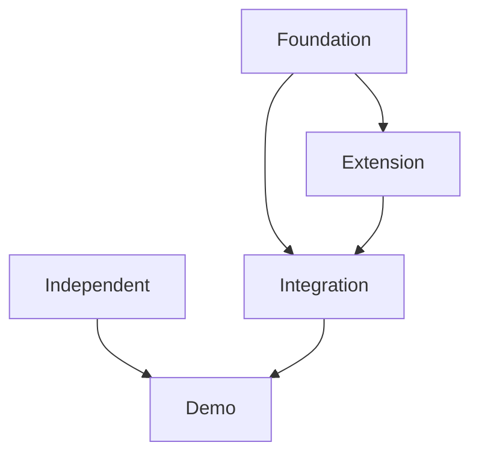

# Week Transition Guide
*How to prepare for the next week of development*

## Overview

This guide documents the process for transitioning from one completed week to the next week of development. Follow these steps after completing all missions in Week N to prepare for Week N+1.

**Time Required**: 30-60 minutes  
**Tools Needed**: Text editor, terminal access  
**Prerequisites**: Week N must be 100% complete (all missions delivered and tested)

---

## Table of Contents

1. [Prerequisites Checklist](#prerequisites-checklist)
2. [Step 1: Research Mission Planning](#step-1-research-mission-planning)
3. [Step 2: Build Mission Planning](#step-2-build-mission-planning)
4. [Step 3: Update Core Project Files](#step-3-update-core-project-files)
5. [Step 4: Verification](#step-4-verification)
6. [Example: Week 1 → Week 2 Transition](#example-week-1--week-2-transition)
7. [Troubleshooting](#troubleshooting)

---

## Prerequisites Checklist

Before starting the transition, verify Week N is complete:

### Week N Completion Criteria
- [ ] All missions marked complete in `missions/backlog.md`
- [ ] All deliverable files created and tested
- [ ] All tests passing (run `npm test` or equivalent)
- [ ] `missions/current.md` shows last mission as complete
- [ ] Week N summary documented in `missions/current.md`
- [ ] Session logged in `SESSIONS.jsonl`
- [ ] Performance targets met (check mission success criteria)

### Documentation Updated
- [ ] `PROJECT_CONTEXT.json` reflects Week N completion
- [ ] `AI_HANDOFF.md` shows Week N achievements
- [ ] Code files have inline documentation
- [ ] Any architectural decisions documented

**If any item is incomplete, finish Week N before proceeding.**

---

## Step 1: Research Mission Planning

### 1.1 Identify Research Needs

Review the upcoming week's build missions and identify what research is needed:

```bash
# Look at the backlog for Week N+1
cat missions/backlog.md | grep "Week N+1" -A 20

# Check if research missions already exist
ls missions/research/ | grep "SPRINT_0N"
```

**Common Research Topics:**
- New technology/library evaluation (e.g., graph databases, visualization libraries)
- Performance optimization strategies
- Algorithm selection and benchmarking
- Architecture patterns for complex features

### 1.2 Create Research Mission File (If Needed)

**Only create new research if:**
- The technology/approach is new to the project
- Performance characteristics need validation
- Multiple implementation options need comparison
- Technical feasibility is uncertain

**Skip research if:**
- Technology/pattern already used in previous weeks
- Implementation is straightforward
- No ambiguity in approach

**Format**: `missions/research/SPRINT_0N_RESEARCH_RN.X.md`

Example: `missions/research/SPRINT_02_RESEARCH_R2.1.md`

**Research File Structure:**
```markdown
# [Topic] Research for Week N

## Research Questions
- What library/approach should we use?
- What are the performance characteristics?
- What are the tradeoffs?

## Findings
[Detailed research with benchmarks, comparisons, examples]

## Recommendations
- Primary recommendation with justification
- Performance targets validated
- Implementation patterns to follow

## References
[Links to docs, benchmarks, examples]
```

### 1.3 Document Research Completion

Update `missions/backlog.md`:
```markdown
### Week N Research
- [x] RN.1: [Topic] Research
  - File: missions/research/SPRINT_0N_RESEARCH_RN.1.md
  - Covers: [key findings]
```

---

## Step 2: Build Mission Planning

### 2.1 Create Week Build Plan

Create `missions/week-0N/BUILD_WEEKN.md` with all missions for the week.

**File Location**: `missions/week-0N/BUILD_WEEKN.md`  
**Example**: `missions/week-02/BUILD_WEEK2.md`

### 2.2 Determine Mission Order

**Key Principle**: Order by technical dependencies, not artificial urgency.

**Questions to Ask:**
1. Which mission provides foundation for others?
2. What can be built independently?
3. What requires multiple prior missions?
4. What demonstrates everything working together?

**Typical Pattern:**
```
Mission 1: Core Infrastructure (foundational)
Mission 2: Extensions (uses Mission 1)
Mission 3: Independent Feature (parallel track)
Mission 4: Integration Feature (uses Mission 1 + 2)
Mission 5: Demo/Polish (uses everything)
```

### 2.3 Build Mission Template

Each mission in `BUILD_WEEKN.md` should include:

```markdown
# Mission BN.X: [Name]
*Week N, Day X - [Category]*

## Mission Metadata
- **Session Type**: Build
- **Estimated Tokens**: XXk
- **Complexity**: High/Medium/Low
- **Dependencies**: [Previous missions required]
- **Enables**: [What this unlocks]

## Research Foundation Applied
- [Key findings from research that guide this mission]
- [Performance targets from research]
- [Technical decisions based on research]

## Implementation Scope
### Core Deliverable
```javascript
// High-level code structure showing interfaces
```

## Success Criteria
- ✅ [Functional requirement 1]
- ✅ [Performance requirement 1]
- ✅ [Test coverage requirement]

## Deliverables Checklist
- [ ] File: path/to/file.js
- [ ] Tests: path/to/test.js
- [ ] Docs: path/to/docs.md

## Handoff Context
```json
{
  "completed": ["what was built"],
  "interfaces": {"key methods/APIs"},
  "performance": {"actual metrics"},
  "next_mission": "BN.X+1"
}
```
```

### 2.4 Add Mission Dependencies Diagram

Include a Mermaid diagram showing mission dependencies:

```markdown
## Week N Mission Dependencies

```

---

## Step 3: Update Core Project Files

### 3.1 Update missions/backlog.md

**Location**: `/missions/backlog.md`

**Changes to Make:**

1. **Mark Week N as Complete**:
```markdown
## Week N: [Theme] ✅ COMPLETE
*Focus: [what was accomplished]*

### Completed
- [x] **Mission BN.1**: [Name] ✅
  - [key achievements]
- [x] **Mission BN.2**: [Name] ✅
  - [key achievements]

**Week N Summary:**
- X files created
- Y tests passing
- [Key achievements]
```

2. **Set Week N+1 as Current Sprint**:
```markdown
## Week N+1: [Theme] (CURRENT SPRINT)
*Focus: [what we're building]*

### Current Mission
- [ ] **Mission BN+1.1**: [Name] (CURRENT - see current.md)
  - [brief description]
  - Research: [research file if applicable]

### Queued
- [ ] **Mission BN+1.2**: [Name]
- [ ] **Mission BN+1.3**: [Name]
```

3. **Update Research Completed Section**:
```markdown
### Week N+1 Research
- [x] RN+1.1: [Topic]
  - File: missions/research/SPRINT_0N+1_RESEARCH_RN+1.1.md
  - Covers: [summary]
```

4. **Update Success Metrics**:
```markdown
### Week N ✅ COMPLETE
- ✅ [metric 1]
- ✅ [metric 2]

### Week N+1 (Current)
- [ ] [target metric 1]
- [ ] [target metric 2]
```

### 3.2 Update missions/current.md

**Location**: `/missions/current.md`

**Replace entire file** with the new current mission:

```markdown
# Current Mission: BN+1.1 - [Name]
*Week N+1, Days X-Y - [Category]*

## Mission Status
- **Phase**: Week N+1 - [Theme]
- **Mission ID**: BN+1.1
- **Status**: READY TO START
- **Started**: Not yet
- **Target Completion**: X days
- **Dependencies**: Week N Complete (BN.1-BN.X) ✅

---

## Mission Overview

[1-2 paragraphs explaining what this mission builds and why]

### Why This Matters
- **BN+1.2** ([Name]): [how it depends on this]
- **BN+1.3** ([Name]): [how it depends on this]

---

## Research Foundation

**Primary Research**: `missions/research/SPRINT_0N+1_RESEARCH_RN+1.1.md`

### Key Findings Applied
1. [Key finding with impact]
2. [Performance target validated]
3. [Technical decision made]

### Performance Targets
```javascript
{
  "metric_1": "target_value",
  "metric_2": "target_value"
}
```

---

## Technical Scope

[Detailed implementation scope from BUILD_WEEKN.md]

---

## Implementation Plan

### Phase 1: [Part 1] (Day X, Part 1)
- [ ] Task 1
- [ ] Task 2

**Files to Create:**
- `path/to/file1.js`

[Repeat for all phases]

---

## Success Criteria

### Functional Requirements
- ✅ [Requirement 1]
- ✅ [Requirement 2]

### Performance Requirements
- ✅ [Performance target 1]
- ✅ [Performance target 2]

### Test Coverage
- ✅ [Coverage requirement]

---

## Files to Create

[Complete list with directory structure]

---

## Integration Points

### With Week N Deliverables
- [How this uses previous work]

### Enables Week N+1 Missions
- [What this unlocks]

---

## Context for AI Assistant

### What Already Exists
- ✅ [Existing component 1]
- ✅ [Existing component 2]

### Key Patterns to Reuse
- [Pattern from previous week]
- [Pattern from previous week]

### Dependencies
```json
{
  "new_dependency": "^1.0.0"
}
```

---

## Handoff Context for Next Mission

[JSON block with completion info]

---

## Notes

### Important Decisions Made
1. [Decision with rationale]

### Watch Out For
- [Potential issue]
- [Edge case]

---

## Week N+1 Context

**Week N+1 Theme**: [Theme]

**Mission Order**:
1. **BN+1.1** (Current): [Name]
2. **BN+1.2** (Next): [Name]
3. **BN+1.3**: [Name]

**Week N+1 Success**: [Overall goal]

---

*Mission BN+1.1 Ready to Start*
*Previous: Week N Complete (BN.1-BN.X)*
*Next: BN+1.2 - [Name]*
*Updated: [Date]*
```

### 3.3 Update PROJECT_CONTEXT.json

**Location**: `/PROJECT_CONTEXT.json`

**Changes to Make:**

1. **Update working_memory**:
```json
{
  "working_memory": {
    "active_domain": "[new domain for Week N+1]",
    "session_count": N+1,
    "last_session": "YYYY-MM-DD-week-N+1-planning"
  }
}
```

2. **Add New Domain for Week N+1 Mission Area**:
```json
{
  "domains": {
    "[new_domain]": {
      "status": "active",
      "priority": 1,
      "current_mission": "BN+1.1",
      "missions": {
        "BN+1.1": {
          "name": "[Mission Name]",
          "status": "in_progress",
          "started": "YYYY-MM-DD",
          "target_completion": "X days"
        }
      },
      "critical_facts": [
        "[Key fact about implementation]",
        "[Performance target]"
      ],
      "constraints": [
        "[Technical constraint]"
      ],
      "decisions_made": [
        "[Key decision with rationale]"
      ],
      "files_to_create": [
        "path/to/file1.js",
        "path/to/file2.js"
      ],
      "research_completed": [
        "missions/research/SPRINT_0N+1_RESEARCH_RN+1.1.md"
      ],
      "achievements": []
    }
  }
}
```

3. **Update Previous Week Domain to "complete"**:
```json
{
  "[previous_domain]": {
    "status": "complete",
    "current_mission": null,
    "achievements": [
      "[What was delivered in Week N]"
    ]
  }
}
```

4. **Update mission_planning**:
```json
{
  "mission_planning": {
    "current_mission": {
      "id": "BN+1.1",
      "name": "[Mission Name]",
      "week": N+1,
      "status": "ready",
      "context_files": [
        "PROJECT_CONTEXT.json",
        "AI_HANDOFF.md",
        "missions/current.md",
        "missions/week-0N+1/BUILD_WEEKN+1.md"
      ],
      "research": [
        "missions/research/SPRINT_0N+1_RESEARCH_RN+1.1.md"
      ],
      "deliverables": [
        "[Key deliverable 1]",
        "[Key deliverable 2]"
      ]
    },
    "next_mission": {
      "id": "BN+1.2",
      "name": "[Next Mission]",
      "status": "queued"
    },
    "week_N+1_missions": {
      "BN+1.1": {
        "name": "[Mission Name]",
        "status": "ready",
        "priority": 1,
        "days": "1-2"
      },
      "BN+1.2": {
        "name": "[Mission Name]",
        "status": "queued",
        "priority": 2,
        "days": "3"
      }
    }
  }
}
```

5. **Update current_sprint**:
```json
{
  "current_sprint": {
    "week": N+1,
    "phase": "Week N+1: [Theme]",
    "active_mission": "BN+1.1: [Mission Name]",
    "completed_missions": [
      "[All missions from Week 1 through Week N]"
    ],
    "queued_missions": [
      "BN+1.2: [Name]",
      "BN+1.3: [Name]"
    ],
    "blockers": [],
    "next_milestone": "Week N+2: [Next Theme]",
    "week_N_summary": {
      "total_files_created": X,
      "total_tests": Y,
      "test_coverage": "[description]",
      "performance_targets_met": true,
      "key_achievements": [
        "[Achievement 1]",
        "[Achievement 2]"
      ]
    }
  }
}
```

6. **Update ai_instructions** (if new patterns established):
```json
{
  "ai_instructions": {
    "special_instructions": [
      "[Existing instructions]",
      "[New instruction based on Week N learnings]"
    ]
  }
}
```

### 3.4 Update AI_HANDOFF.md

**Location**: `/AI_HANDOFF.md`

**Changes to Make:**

1. **Update header section**:
```markdown
## Current Status
- **Phase**: Week N+1 - [Theme]
- **Sprint**: Build Phase
- **Current Mission**: BN+1.1 - [Mission Name] (READY TO START)
- **Previous Mission**: BN.X - [Last Week N Mission] ✅ Complete
- **Next Mission**: BN+1.2 - [Next Mission] (Queued)
```

2. **Add Week N completion summary**:
```markdown
## Week N Complete! ✅

### All Week N Missions Delivered
- ✅ **BN.1**: [Mission Name]
- ✅ **BN.2**: [Mission Name]
- ✅ **BN.X**: [Mission Name]

### Week N Summary
**Total Deliverables:**
- X production files created
- Y passing tests
- [Key achievements]
```

3. **Add Current Mission section** (from current.md):
```markdown
## Current Mission: BN+1.1 [Mission Name]

### Mission Overview
[Brief overview]

### Research Foundation
**Primary Research**: `missions/research/SPRINT_0N+1_RESEARCH_RN+1.1.md`

[Key findings and targets]

---

## Technical Scope for BN+1.1

[Implementation details from current.md]
```

4. **Update "Context for AI Assistant" section**:
```markdown
## Context for AI Assistant

### What Already Exists
- ✅ [Week N deliverable 1]
- ✅ [Week N deliverable 2]

### Key Patterns to Reuse
- [Pattern from Week N]
- [Pattern from earlier weeks]
```

5. **Add "Week N+1 Context" section**:
```markdown
## Week N+1 Context

**Week N+1 Theme**: [Theme]

**Mission Order**:
1. **BN+1.1** (Current): [Name] - [Brief description]
2. **BN+1.2** (Next): [Name] - [Brief description]
3. **BN+1.3**: [Name] - [Brief description]

**Week N+1 Success**: [Overall goal for the week]
```

6. **Update footer**:
```markdown
---

*Mission BN+1.1 Ready to Start*
*Week N Complete: All X missions delivered ✅*
*Week N+1 Active: [Theme]*
*Updated: [Current Date]*
*Protocol-Driven Discovery v0.X.0*
```

---

## Step 4: Verification

### 4.1 File Verification Checklist

Run these checks before declaring the transition complete:

```bash
# 1. Verify all mission files exist
ls missions/week-0N+1/BUILD_WEEKN+1.md
ls missions/research/SPRINT_0N+1_RESEARCH_RN+1.1.md  # if created

# 2. Check core files are updated
grep "Week N+1" missions/backlog.md
grep "BN+1.1" missions/current.md
grep "week.*N+1" PROJECT_CONTEXT.json
grep "Week N+1" AI_HANDOFF.md

# 3. Verify JSON is valid
node -e "JSON.parse(require('fs').readFileSync('PROJECT_CONTEXT.json'))"

# 4. Check for placeholder text
grep -r "TODO\|FIXME\|XXX" missions/current.md missions/backlog.md AI_HANDOFF.md
```

### 4.2 Content Verification Checklist

- [ ] **missions/backlog.md**
  - [ ] Week N marked as complete with ✅
  - [ ] Week N+1 marked as "CURRENT SPRINT"
  - [ ] First mission marked as "CURRENT - see current.md"
  - [ ] All other missions marked as queued
  - [ ] Research section updated if applicable

- [ ] **missions/current.md**
  - [ ] Shows BN+1.1 as current mission
  - [ ] Includes research foundation section
  - [ ] Has complete implementation plan
  - [ ] Lists all files to create
  - [ ] Has success criteria clearly defined
  - [ ] Includes handoff context for next mission

- [ ] **PROJECT_CONTEXT.json**
  - [ ] Valid JSON (no syntax errors)
  - [ ] active_domain updated
  - [ ] session_count incremented
  - [ ] New domain added with "active" status
  - [ ] Previous domain marked "complete"
  - [ ] current_mission updated
  - [ ] week_N+1_missions section added
  - [ ] current_sprint.week = N+1
  - [ ] Dependencies added if needed

- [ ] **AI_HANDOFF.md**
  - [ ] Current status updated to Week N+1
  - [ ] Week N completion summary added
  - [ ] Current mission BN+1.1 detailed
  - [ ] Research foundation included
  - [ ] Technical scope from current.md
  - [ ] Week N+1 context section added
  - [ ] Footer updated with new date

### 4.3 Cross-Reference Verification

Ensure consistency across files:

```bash
# Mission IDs should match everywhere
grep -r "BN+1.1" missions/backlog.md missions/current.md PROJECT_CONTEXT.json AI_HANDOFF.md

# Week numbers should be consistent
grep -r "Week N+1" missions/backlog.md missions/current.md AI_HANDOFF.md

# Mission names should match
grep "BN+1.1.*:" missions/backlog.md missions/current.md AI_HANDOFF.md
```

**Look for:**
- [ ] Mission ID "BN+1.1" appears in all 4 files
- [ ] Mission name is identical in all references
- [ ] Week N+1 theme is consistent
- [ ] Dependencies referenced correctly
- [ ] File paths mentioned are consistent

---

## Example: Week 1 → Week 2 Transition

### Context
- **Week 1 Complete**: OpenAPI Importer, Postgres Importer, CLI, Workflow, E2E Testing
- **Week 2 Goal**: Add graph-based analysis and governance reporting
- **Key Research**: Graph performance optimization (SPRINT_02_RESEARCH_R2.1.md)

### Step 1: Research

✅ Already completed: `missions/research/SPRINT_02_RESEARCH_R2.1.md`
- Evaluated graph libraries (chose Graphology)
- Validated Tarjan's algorithm for cycle detection
- Confirmed <10ms performance for 1000 nodes achievable
- Established caching strategy (LRU with 10-20% cache size)

### Step 2: Build Mission Planning

Created `missions/week-02/BUILD_WEEK2.md` with 5 missions:

**Mission Order (by dependency):**
1. **B2.1**: ProtocolGraph - Foundation (uses Graphology)
2. **B2.2**: Validators & Diff Engine - Uses graph for validation
3. **B2.3**: Community Overrides Engine - Independent feature
4. **B2.4**: GOVERNANCE.md Generator - Uses graph + validators
5. **B2.5**: Curated Seeds - Demonstrates everything

**Rationale:**
- B2.1 first because it's foundation for B2.2 and B2.4
- B2.2 next because B2.4 needs validators
- B2.3 parallel track (no dependencies on graph)
- B2.4 needs both graph and validators
- B2.5 last as integration demo

### Step 3: Update Core Files

#### missions/backlog.md
```markdown
## Week 1: MVP Development ✅ COMPLETE
- [x] **Mission B1.1**: OpenAPI Importer ✅
- [x] **Mission B1.2**: Postgres Importer ✅
- [x] **Mission B1.3**: CLI Framework ✅
- [x] **Mission B1.4**: Draft/Approve Workflow ✅
- [x] **Mission B1.5**: End-to-End Testing ✅

## Week 2: Governance & Protocol Integration (CURRENT SPRINT)

### Current Mission
- [ ] **Mission B2.1**: ProtocolGraph Implementation (CURRENT - see current.md)
  - URN resolution and indexing with Graphology
  - Research: missions/research/SPRINT_02_RESEARCH_R2.1.md

### Queued
- [ ] **Mission B2.2**: Validators & Diff Engine
- [ ] **Mission B2.3**: Community Overrides Engine
- [ ] **Mission B2.4**: GOVERNANCE.md Generator
- [ ] **Mission B2.5**: Curated Seeds System
```

#### missions/current.md
```markdown
# Current Mission: B2.1 - ProtocolGraph Implementation
*Week 2, Days 1-2 - Core Infrastructure*

## Mission Status
- **Phase**: Week 2 - Governance & Protocol Integration
- **Mission ID**: B2.1
- **Status**: READY TO START
- **Dependencies**: Week 1 Complete (B1.1-B1.5) ✅

## Research Foundation
**Primary Research**: `missions/research/SPRINT_02_RESEARCH_R2.1.md`

### Key Findings Applied
1. **Graph Library**: Graphology (JavaScript-native, comprehensive)
2. **Cycle Detection**: Tarjan's algorithm O(V+E)
3. **Performance**: <10ms for 1000 nodes validated
4. **Caching**: LRU with 10-20% cache size achieves 70-80% hit ratio

[... rest of mission spec ...]
```

#### PROJECT_CONTEXT.json
```json
{
  "working_memory": {
    "active_domain": "graph",
    "session_count": 6,
    "last_session": "2025-09-30-week-2-planning"
  },
  "domains": {
    "graph": {
      "status": "active",
      "priority": 1,
      "current_mission": "B2.1",
      "missions": {
        "B2.1": {
          "name": "ProtocolGraph Implementation",
          "status": "in_progress",
          "started": "2025-09-30",
          "target_completion": "2 days"
        }
      },
      "critical_facts": [
        "Use Graphology for graph operations",
        "Tarjan's algorithm for cycle detection O(V+E)",
        "Performance target: <10ms for 1000 nodes"
      ],
      "files_to_create": [
        "app/core/graph/protocol-graph.js",
        "app/core/graph/tarjan.js",
        "app/core/graph/pii-tracer.js"
      ]
    },
    "importers": {
      "status": "complete",
      "current_mission": null
    }
  },
  "mission_planning": {
    "current_mission": {
      "id": "B2.1",
      "name": "ProtocolGraph Implementation",
      "week": 2,
      "status": "ready"
    },
    "week_2_missions": {
      "B2.1": { "status": "ready", "priority": 1, "days": "1-2" },
      "B2.2": { "status": "queued", "priority": 2, "days": "3" }
    }
  },
  "current_sprint": {
    "week": 2,
    "phase": "Week 2: Governance & Protocol Integration",
    "active_mission": "B2.1: ProtocolGraph Implementation"
  }
}
```

#### AI_HANDOFF.md
```markdown
## Current Status
- **Phase**: Week 2 - Governance & Protocol Integration
- **Current Mission**: B2.1 - ProtocolGraph Implementation (READY TO START)
- **Previous Mission**: B1.5 - End-to-End Testing ✅ Complete

## Week 1 Complete! ✅
- ✅ **B1.1**: OpenAPI Importer
- ✅ **B1.2**: Postgres Importer
- ✅ **B1.3**: CLI Framework
- ✅ **B1.4**: Workflow
- ✅ **B1.5**: E2E Testing

## Current Mission: B2.1 ProtocolGraph Implementation

### Research Foundation
**Primary Research**: `missions/research/SPRINT_02_RESEARCH_R2.1.md`

[... mission details ...]

## Week 2 Context
**Week 2 Theme**: Governance & Protocol Integration

**Mission Order**:
1. **B2.1** (Current): ProtocolGraph - Foundation
2. **B2.2** (Next): Validators & Diff Engine
```

### Step 4: Verification

```bash
# ✅ All files exist
ls missions/week-02/BUILD_WEEK2.md  # exists
ls missions/research/SPRINT_02_RESEARCH_R2.1.md  # exists

# ✅ Core files updated
grep "Week 2" missions/backlog.md  # found
grep "B2.1" missions/current.md  # found
grep "week.*2" PROJECT_CONTEXT.json  # found

# ✅ JSON valid
node -e "JSON.parse(require('fs').readFileSync('PROJECT_CONTEXT.json'))"
# No errors

# ✅ No placeholders
grep -r "TODO\|XXX" missions/current.md missions/backlog.md
# None found

# ✅ Mission ID consistency
grep -r "B2.1" missions/backlog.md missions/current.md PROJECT_CONTEXT.json AI_HANDOFF.md
# All references consistent
```

**Result**: Week 2 ready to start! ✅

---

## Troubleshooting

### Issue: Research Isn't Complete

**Symptom**: Week N+1 needs technical validation but research doesn't exist.

**Solution**:
1. Create research mission file first
2. Conduct research (can be done async)
3. Update BUILD_WEEKN+1.md with findings
4. Don't start Week N+1 build missions until research complete

### Issue: Mission Dependencies Unclear

**Symptom**: Not sure which mission should come first.

**Solution**:
1. Draw dependency graph manually
2. Ask: "Can Mission X be built without Mission Y?"
3. Foundation missions always first
4. Integration missions last
5. Independent features can be parallel

**Rule of Thumb**: If Mission X reads/uses output from Mission Y, then Y must come before X.

### Issue: JSON Syntax Error in PROJECT_CONTEXT.json

**Symptom**: JSON parsing fails during verification.

**Solution**:
```bash
# Find the syntax error
node -e "JSON.parse(require('fs').readFileSync('PROJECT_CONTEXT.json'))"

# Common issues:
# - Missing comma after object
# - Trailing comma before }
# - Unescaped quotes in strings
# - Missing closing bracket

# Use a JSON validator
cat PROJECT_CONTEXT.json | jq .
```

### Issue: Inconsistent Mission Names Across Files

**Symptom**: Same mission called different things in different files.

**Solution**:
1. Choose canonical name (usually from BUILD_WEEKN.md)
2. Search and replace in all 4 files
3. Re-run verification step

```bash
# Find all references
grep -r "Mission Name" missions/ PROJECT_CONTEXT.json AI_HANDOFF.md

# Update all files to match
```

### Issue: Week N Not Actually Complete

**Symptom**: Tests failing, files missing, or performance targets not met.

**Solution**:
1. **STOP** - do not proceed with transition
2. Go back and finish Week N
3. Update Week N final status in all files
4. Only then proceed with Week N+1 transition

**Critical**: Never start Week N+1 with incomplete Week N deliverables.

### Issue: Forgot to Document Research

**Symptom**: Research was done but not documented in proper format.

**Solution**:
1. Create research file retroactively
2. Document findings, benchmarks, decisions
3. Reference in BUILD_WEEKN+1.md
4. Add to PROJECT_CONTEXT.json research section

**Prevention**: Always create research file BEFORE starting research, even if empty.

---

## Best Practices

### Do's ✅
- ✅ Complete Week N 100% before starting transition
- ✅ Write research findings before build missions
- ✅ Order missions by technical dependencies
- ✅ Keep mission names consistent across all files
- ✅ Verify JSON syntax before committing
- ✅ Run all verification checks
- ✅ Document key decisions and rationale
- ✅ Include performance targets from research

### Don'ts ❌
- ❌ Skip verification steps
- ❌ Order missions by arbitrary "importance"
- ❌ Copy/paste without updating specifics
- ❌ Leave TODO/FIXME placeholders
- ❌ Start Week N+1 with Week N incomplete
- ❌ Forget to update all 4 core files
- ❌ Ignore JSON syntax errors
- ❌ Skip research when technology is new

---

## Quick Reference

### Files to Update (Always)
1. `missions/backlog.md` - Mark Week N complete, set Week N+1 current
2. `missions/current.md` - Replace with BN+1.1 mission spec
3. `PROJECT_CONTEXT.json` - Update domains, missions, sprint
4. `AI_HANDOFF.md` - Add Week N summary, update current mission

### Files to Create (As Needed)
- `missions/week-0N+1/BUILD_WEEKN+1.md` - Always create
- `missions/research/SPRINT_0N+1_RESEARCH_RN+1.X.md` - If research needed

### Verification Commands
```bash
# Check file existence
ls missions/week-0N+1/BUILD_WEEKN+1.md
ls missions/current.md

# Validate JSON
node -e "JSON.parse(require('fs').readFileSync('PROJECT_CONTEXT.json'))"

# Check for placeholders
grep -r "TODO\|FIXME\|XXX\|\\[FILL" missions/ AI_HANDOFF.md

# Verify mission ID consistency
grep -r "BN+1.1" missions/backlog.md missions/current.md PROJECT_CONTEXT.json AI_HANDOFF.md
```

---

## Summary

This transition process ensures:
- ✅ **Completeness**: Week N fully delivered before starting Week N+1
- ✅ **Clarity**: Current mission clearly documented in all files
- ✅ **Context**: AI assistants have all information needed
- ✅ **Consistency**: Mission names and IDs match across files
- ✅ **Research-Driven**: Technical decisions backed by validation
- ✅ **Dependency-Aware**: Mission order reflects technical requirements

**Time Investment**: 30-60 minutes per week transition  
**Payoff**: Smooth, context-rich development with no ambiguity

---

*Last Updated: September 30, 2025*  
*Version: 1.0*  
*Process validated: Week 1 → Week 2 transition*
