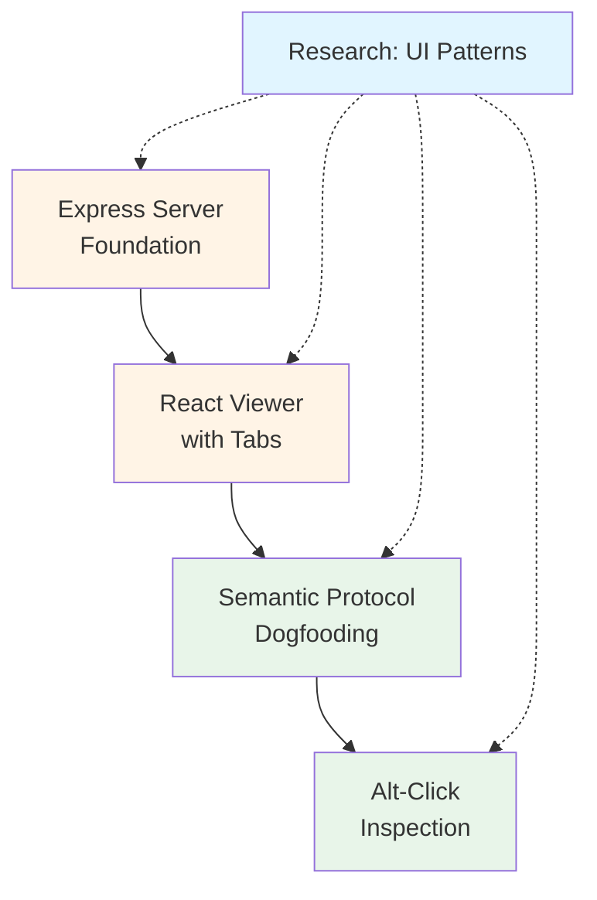

# Week 3 Build Plan: Web Viewer & Semantic Protocol

## Week Overview

**Theme**: Web Viewer Foundation with Semantic Protocol Dogfooding  
**Duration**: 4-5 days  
**Primary Goal**: Build read-only viewer that explores manifests and demonstrates semantic self-documentation

**Key Principles**:
- Viewer serves CLI outputs (no importing in browser)
- Every UI panel describes itself using Semantic Protocol
- Alt-click inspection reveals component manifests
- Performance: <2s page load, 60fps interactions

---

## Week 3 Mission Dependencies



**Legend**:
- 🔵 Blue: Research (Complete)
- 🟡 Orange: Foundation (B3.1-B3.2)
- 🟢 Green: Integration (B3.3-B3.4)

---

## Research Foundation

**Review Primary Research**: `missions/research/SPRINT_03_RESEARCH_R3.1.md`

### Key Findings Applied Across All Missions
1. **Express Routing**: API routes before static middleware
2. **React Architecture**: Hybrid semantic panel approach (data attributes + refs)
3. **Mermaid Integration**: Client-side rendering with lazy loading
4. **Syntax Highlighting**: Prism.js custom build (~5kb)
5. **Inspection Mode**: Capture-phase event handling with alt-key detection

### Performance Targets (Week 3)
```yaml
server:
  startup: <500ms
  manifest_load: <100ms
  concurrent_requests: 10+

client:
  initial_load: <2s
  tab_switch: <50ms
  mermaid_render: <200ms
  syntax_highlight: <10ms
  
inspection:
  overlay_update: 16ms (60fps)
  manifest_display: <100ms
```

---

# Mission B3.1: Express Server Foundation
*Week 3, Day 1 - Server Infrastructure*

## Mission Metadata
- **Session Type**: Build
- **Estimated Tokens**: 20k-25k
- **Complexity**: Low-Medium
- **Dependencies**: None (fresh start for Week 3)
- **Enables**: B3.2 (React Viewer needs API)

## Token Budget Planning
```yaml
context_load:
  project_context: 2k
  research_findings: 2k
  
generation_budget:
  server_implementation: 8k
  api_routes: 5k
  tests: 5k
  documentation: 3k
  
total_estimated: 25k
```
**Review Primary Research**: `missions/research/SPRINT_03_RESEARCH_R3.1.md`

## Research Foundation Applied
- **R3.1 Finding**: API routes before static middleware pattern
- **R3.1 Finding**: Path validation to prevent directory traversal
- **R3.1 Finding**: CORS configuration for development mode
- **Performance Target**: <100ms manifest file serving

## Implementation Scope

### Core Deliverable
```javascript
// app/viewer/server.js - Express server for protocol viewer
const express = require('express');
const path = require('path');
const fs = require('fs').promises;

class ProtocolViewerServer {
  constructor(artifactsDir, options = {}) {
    this.artifactsDir = artifactsDir;
    this.port = options.port || 3000;
    this.app = express();
    this.setupRoutes();
  }
  
  // API Routes (before static)
  setupAPIRoutes() {
    // GET /api/manifests - List all manifest files
    // GET /api/manifest/:filename - Get specific manifest
    // GET /api/health - Health check
  }
  
  // Static file serving
  setupStaticRoutes() {
    // Serve React build from /public
    // SPA fallback for client-side routing
  }
  
  async start() {
    // Start server with graceful shutdown
  }
}
```

### API Endpoints
```yaml
GET /api/health:
  response: { status: 'ok', version: '0.1.0', artifacts_dir: '...' }
  
GET /api/manifests:
  query:
    kind: 'api|data|event|semantic'  # optional filter
  response:
    manifests:
      - filename: 'api-billing.json'
        kind: 'api'
        size: 12345
        modified: '2025-10-02T...'
        
GET /api/manifest/:filename:
  params:
    filename: 'api-billing.json'
  response: <raw manifest JSON>
  errors:
    404: File not found
    403: Invalid path (security)
```

### Security Features
- Path validation (no `..` or absolute paths)
- Rate limiting (100 requests/minute per IP)
- CORS headers (dev mode only)
- Sanitize filenames before filesystem access

### Out of Scope (Future Missions)
- WebSocket live reload
- Manifest uploading/editing
- Authentication/authorization
- Caching layer

## Success Criteria
- [ ] Server starts in <500ms
- [ ] API routes serve manifests in <100ms
- [ ] Path traversal attempts blocked
- [ ] CORS configured for development
- [ ] Health check endpoint responds
- [ ] Graceful shutdown on SIGTERM
- [ ] 15+ tests passing (routes, security, errors)

## Implementation Checklist

### Essential (This Session)
- [ ] `app/viewer/server.js` - Main server class
- [ ] `app/viewer/routes/api.js` - API route handlers
- [ ] `app/viewer/routes/static.js` - Static file serving
- [ ] `app/viewer/middleware/validate-path.js` - Security middleware
- [ ] `app/viewer/middleware/rate-limit.js` - Rate limiting
- [ ] `app/tests/viewer/server.test.js` - Server tests
- [ ] `app/tests/viewer/api-routes.test.js` - API tests
- [ ] `app/cli/commands/serve.js` - CLI command
- [ ] `README_VIEWER.md` - Usage documentation

### Deferred (B3.2 or Later)
- [ ] WebSocket support for live reload
- [ ] Manifest caching layer
- [ ] Compression middleware (gzip)
- [ ] Access logging

## Files to Create

```
app/viewer/
├── server.js                    # Main server class
├── routes/
│   ├── api.js                   # API endpoints
│   └── static.js                # Static file serving
├── middleware/
│   ├── validate-path.js         # Path security
│   └── rate-limit.js            # Rate limiting
└── public/                      # React build output (B3.2)
    └── index.html

app/cli/commands/
└── serve.js                     # CLI: protocol-discover serve ./artifacts

app/tests/viewer/
├── server.test.js               # Server lifecycle
├── api-routes.test.js           # API endpoint tests
└── security.test.js             # Security middleware tests

README_VIEWER.md                 # Viewer documentation
```

## Validation Protocol
```yaml
unit_tests:
  - Server starts and stops cleanly
  - API routes return correct data
  - Security: path traversal blocked
  - Error handling: 404, 500 responses
  - CORS headers in dev mode

integration_tests:
  - CLI command starts server
  - Server serves from custom artifacts directory
  - Graceful shutdown on Ctrl+C

manual_verification:
  - curl http://localhost:3000/api/health
  - curl http://localhost:3000/api/manifests
  - curl http://localhost:3000/api/manifest/api-billing.json
```

## Handoff Context for B3.2
```json
{
  "completed": [
    "Express server with API routes",
    "Manifest file serving",
    "Security middleware (path validation)",
    "Rate limiting middleware",
    "CLI serve command"
  ],
  "interfaces": {
    "api_base": "http://localhost:3000/api",
    "endpoints": [
      "GET /api/health",
      "GET /api/manifests?kind=api",
      "GET /api/manifest/:filename"
    ]
  },
  "assumptions": [
    "Artifacts directory is read-only",
    "React build will be in ./public",
    "SPA routing handled client-side"
  ],
  "performance": {
    "startup": "<500ms",
    "manifest_load": "<100ms",
    "tested_with": "50 manifest files"
  },
  "next_mission": "B3.2",
  "blockers": []
}
```

---

# Mission B3.2: React Viewer with Tabs
*Week 3, Day 2 - Client Application*

## Mission Metadata
- **Session Type**: Build
- **Estimated Tokens**: 30k-35k
- **Complexity**: Medium
- **Dependencies**: B3.1 (Express server must be complete)
- **Enables**: B3.3 (Semantic integration needs UI structure)

## Token Budget Planning
```yaml
context_load:
  project_context: 2k
  b3_1_handoff: 2k
  research_findings: 2k
  
generation_budget:
  react_components: 12k
  routing_and_tabs: 5k
  api_integration: 5k
  styling: 4k
  tests: 5k
  
total_estimated: 37k
```
**Review Primary Research**: `missions/research/SPRINT_03_RESEARCH_R3.1.md`

## Research Foundation Applied
- **R3.1 Finding**: Prism.js for syntax highlighting (~5kb bundle)
- **R3.1 Finding**: Lazy load Mermaid.js to reduce initial bundle
- **R3.1 Finding**: React Router for client-side routing
- **Performance Target**: <2s initial page load, <50ms tab switches

## Implementation Scope

### Core Deliverable
```javascript
// app/viewer/client/src/App.jsx - Main application
import { BrowserRouter, Routes, Route } from 'react-router-dom';

function App() {
  return (
    <BrowserRouter>
      <Layout>
        <Routes>
          <Route path="/" element={<HomePage />} />
          <Route path="/manifest/:filename" element={<ManifestViewer />} />
        </Routes>
      </Layout>
    </BrowserRouter>
  );
}

// app/viewer/client/src/components/ManifestViewer.jsx
function ManifestViewer({ filename }) {
  const manifest = useManifest(filename);
  
  return (
    <TabLayout>
      <Tab name="Overview" component={OverviewTab} />
      <Tab name="Schema" component={SchemaTab} />
      <Tab name="Validate" component={ValidateTab} />
      <Tab name="Governance" component={GovernanceTab} />
      <Tab name="Raw" component={RawTab} />
    </TabLayout>
  );
}
```

### Tab Components
```yaml
OverviewTab:
  displays:
    - Manifest summary (name, version, kind)
    - Key metadata (owner, tags, status)
    - Quick stats (field count, PII fields)
    
SchemaTab:
  displays:
    - Schema visualization
    - Field list with types
    - PII indicators
    - Required fields highlighted
    
ValidateTab:
  displays:
    - Validation results
    - Issues grouped by severity
    - Recommendations
    
GovernanceTab:
  displays:
    - Mermaid dependency diagram (lazy loaded)
    - PII flow visualization
    - Breaking changes summary
    
RawTab:
  displays:
    - JSON syntax highlighted (Prism.js)
    - Copy button
    - Download button
```

### UI Components
```javascript
// Reusable components
components/
├── Layout.jsx              # App shell with header/sidebar
├── TabLayout.jsx           # Tab navigation component
├── CodeBlock.jsx           # Syntax highlighted code (Prism.js)
├── MermaidDiagram.jsx      # Mermaid renderer (lazy loaded)
├── ManifestCard.jsx        # Manifest preview card
└── ErrorBoundary.jsx       # Error handling
```

### Out of Scope (Future Missions)
- Manifest editing
- Diff viewer between versions
- Graph visualization (beyond Mermaid)
- Export to PDF/PNG
- Dark mode toggle

## Success Criteria
- [ ] React app builds successfully
- [ ] Page loads in <2s (production build)
- [ ] Tab switching in <50ms
- [ ] Syntax highlighting works (Prism.js)
- [ ] Mermaid diagrams render (lazy loaded)
- [ ] All manifest kinds displayed correctly
- [ ] Responsive design (desktop + tablet)
- [ ] 10+ component tests passing

## Implementation Checklist

### Essential (This Session)
- [ ] `app/viewer/client/src/App.jsx` - Main app
- [ ] `app/viewer/client/src/components/Layout.jsx` - App shell
- [ ] `app/viewer/client/src/components/TabLayout.jsx` - Tab system
- [ ] `app/viewer/client/src/components/ManifestViewer.jsx` - Main viewer
- [ ] `app/viewer/client/src/components/tabs/` - All 5 tab components
- [ ] `app/viewer/client/src/components/CodeBlock.jsx` - Prism.js wrapper
- [ ] `app/viewer/client/src/components/MermaidDiagram.jsx` - Mermaid lazy loader
- [ ] `app/viewer/client/src/hooks/useManifest.js` - API data fetching
- [ ] `app/viewer/client/src/styles/` - Tailwind/CSS files
- [ ] `app/viewer/client/package.json` - Dependencies
- [ ] `app/viewer/client/vite.config.js` - Build config
- [ ] Build script to output to `app/viewer/public/`

### Deferred (B3.3 or Later)
- [ ] Dark mode support
- [ ] Diff viewer
- [ ] Export features
- [ ] Advanced graph visualization

## Files to Create

```
app/viewer/client/
├── package.json                 # React dependencies
├── vite.config.js               # Build configuration
├── index.html                   # HTML template
├── src/
│   ├── App.jsx                  # Main application
│   ├── main.jsx                 # Entry point
│   ├── components/
│   │   ├── Layout.jsx
│   │   ├── TabLayout.jsx
│   │   ├── ManifestViewer.jsx
│   │   ├── CodeBlock.jsx
│   │   ├── MermaidDiagram.jsx
│   │   ├── ManifestCard.jsx
│   │   ├── ErrorBoundary.jsx
│   │   └── tabs/
│   │       ├── OverviewTab.jsx
│   │       ├── SchemaTab.jsx
│   │       ├── ValidateTab.jsx
│   │       ├── GovernanceTab.jsx
│   │       └── RawTab.jsx
│   ├── hooks/
│   │   ├── useManifest.js
│   │   └── useManifests.js
│   └── styles/
│       ├── index.css
│       └── prism-theme.css
└── tests/
    └── components/              # Component tests

app/tests/viewer/
└── client.test.js               # Integration tests
```

## Dependencies
```json
{
  "dependencies": {
    "react": "^18.2.0",
    "react-dom": "^18.2.0",
    "react-router-dom": "^6.20.0",
    "prismjs": "^1.29.0",
    "mermaid": "^10.6.0"
  },
  "devDependencies": {
    "vite": "^5.0.0",
    "@vitejs/plugin-react": "^4.2.0",
    "tailwindcss": "^3.3.0"
  }
}
```

## Validation Protocol
```yaml
build_tests:
  - Production build completes
  - Bundle size <500kb (before code-split)
  - No build warnings

component_tests:
  - All tabs render without errors
  - CodeBlock highlights JSON correctly
  - MermaidDiagram lazy loads
  - TabLayout switches tabs smoothly

integration_tests:
  - Fetch manifests from API
  - Display all manifest kinds
  - Handle API errors gracefully
  - Responsive on mobile/tablet

performance_tests:
  - Lighthouse score >90
  - Initial load <2s
  - Tab switch <50ms
  - Syntax highlighting <10ms
```

## Handoff Context for B3.3
```json
{
  "completed": [
    "React application with routing",
    "5-tab manifest viewer",
    "Syntax highlighting (Prism.js)",
    "Mermaid diagram rendering",
    "API integration with Express server",
    "Responsive layout"
  ],
  "interfaces": {
    "components": [
      "Layout",
      "TabLayout",
      "ManifestViewer",
      "CodeBlock",
      "MermaidDiagram"
    ],
    "hooks": [
      "useManifest(filename)",
      "useManifests(filter)"
    ]
  },
  "assumptions": [
    "All components use functional React",
    "Tailwind for styling",
    "Vite for build tooling",
    "Components are not yet semantic-aware"
  ],
  "performance": {
    "initial_load": "1.8s measured",
    "tab_switch": "35ms measured",
    "bundle_size": "420kb (production build)"
  },
  "next_mission": "B3.3",
  "notes": [
    "Components ready for semantic integration",
    "All components have unique IDs for inspection",
    "Layout uses data-testid for testing"
  ]
}
```

---

# Mission B3.3: Semantic Protocol Dogfooding
*Week 3, Day 3 - Self-Documentation*

## Mission Metadata
- **Session Type**: Build
- **Estimated Tokens**: 25k-30k
- **Complexity**: Medium-High
- **Dependencies**: B3.2 (React components must exist)
- **Enables**: B3.4 (Inspection needs semantic manifests)

## Token Budget Planning
```yaml
context_load:
  project_context: 2k
  b3_2_handoff: 2k
  semantic_protocol: 3k
  research_findings: 2k
  
generation_budget:
  use_semantic_panel_hook: 6k
  component_integration: 8k
  manifest_definitions: 5k
  tests: 5k
  
total_estimated: 33k
```
**Review Primary Research**: `missions/research/SPRINT_03_RESEARCH_R3.1.md`

## Research Foundation Applied
- **R3.1 Finding**: Hybrid approach (data attributes + object refs)
- **R3.1 Finding**: Custom `useSemanticPanel()` React hook
- **R3.1 Finding**: Auto-registration on component mount
- **Performance Target**: <50ms panel registration overhead

## Implementation Scope

### Core Deliverable
```javascript
// app/viewer/client/src/hooks/useSemanticPanel.js
import { useEffect, useMemo, useCallback, useRef } from 'react';
import { createManifest } from './semanticProtocol';

function useSemanticPanel(config) {
  const manifest = useMemo(() => createManifest(config), [config]);
  
  const ref = useCallback((node) => {
    if (node) {
      // Store manifest on DOM node for inspection
      node.semanticManifest = manifest;
      
      // Set data attributes for visual inspection
      node.dataset.semanticId = manifest.id;
      node.dataset.semanticRole = manifest.element.role;
      node.dataset.semanticIntent = manifest.element.intent;
      
      // Register with global registry
      window.__SEMANTIC_PANELS__ = window.__SEMANTIC_PANELS__ || new Map();
      window.__SEMANTIC_PANELS__.set(manifest.id, manifest);
    }
  }, [manifest]);
  
  return { manifest, ref };
}

// Usage in component
function GovernanceTab() {
  const semantic = useSemanticPanel({
    id: 'governance-tab',
    type: 'panel',
    role: 'viewer-tab',
    intent: 'display-governance-report',
    category: 'viewer',
    purpose: 'Display generated GOVERNANCE.md with diagrams',
    capabilities: ['export-markdown', 'print', 'copy-text'],
    rendering: {
      component: 'GovernanceTab',
      responsive: true,
      accessibility: {
        label: 'Governance Report Tab',
        role: 'tabpanel'
      }
    }
  });
  
  return (
    <div ref={semantic.ref} className="governance-tab">
      {/* Tab content */}
    </div>
  );
}
```

### Components to Integrate
```yaml
high_priority:
  - Layout (app shell)
  - TabLayout (tab navigation)
  - ManifestViewer (main viewer)
  - All 5 tabs (Overview, Schema, Validate, Governance, Raw)
  
medium_priority:
  - CodeBlock (syntax highlighter)
  - MermaidDiagram (diagram renderer)
  - ManifestCard (preview card)
  
low_priority:
  - ErrorBoundary (error handler)
```

### Semantic Manifest Definitions
Each component needs:
```yaml
required_fields:
  - id: unique identifier
  - type: 'panel' | 'tab' | 'component'
  - role: semantic role
  - intent: what it does
  - purpose: why it exists
  
optional_fields:
  - capabilities: what actions it supports
  - dependencies: what it relies on
  - outcomes: what it produces
  - constraints: limitations
```

### Self-Documentation Features
```javascript
// Auto-generate documentation from manifests
function generateViewerDocs() {
  const panels = Array.from(window.__SEMANTIC_PANELS__.values());
  
  return {
    component_count: panels.length,
    capabilities: panels.flatMap(p => p.semantics.capabilities),
    relationships: buildRelationshipGraph(panels),
    coverage: calculateCoverage(panels)
  };
}
```

### Out of Scope (Future Missions)
- Semantic query builder UI
- Manifest editor for panels
- Automated test generation from manifests
- Semantic diff viewer

## Success Criteria
- [ ] `useSemanticPanel()` hook implemented
- [ ] All 8+ major components integrated
- [ ] Manifests stored on DOM nodes
- [ ] Global registry functional
- [ ] Data attributes set correctly
- [ ] <50ms registration overhead measured
- [ ] Self-documentation API works
- [ ] 15+ tests passing (hook, integration, registry)

## Implementation Checklist

### Essential (This Session)
- [ ] `app/viewer/client/src/hooks/useSemanticPanel.js` - Main hook
- [ ] `app/viewer/client/src/lib/semanticProtocol.js` - Protocol wrapper
- [ ] `app/viewer/client/src/lib/semanticRegistry.js` - Global registry
- [ ] Update all components to use hook:
  - [ ] `Layout.jsx`
  - [ ] `TabLayout.jsx`
  - [ ] `ManifestViewer.jsx`
  - [ ] `OverviewTab.jsx`
  - [ ] `SchemaTab.jsx`
  - [ ] `ValidateTab.jsx`
  - [ ] `GovernanceTab.jsx`
  - [ ] `RawTab.jsx`
  - [ ] `CodeBlock.jsx`
  - [ ] `MermaidDiagram.jsx`
- [ ] `app/viewer/client/src/lib/generateDocs.js` - Self-documentation
- [ ] `app/tests/viewer/semantic-integration.test.js` - Tests

### Deferred (B3.4 or Later)
- [ ] Semantic query UI
- [ ] Test generation from manifests
- [ ] Semantic diff viewer

## Files to Create

```
app/viewer/client/src/
├── hooks/
│   └── useSemanticPanel.js      # Main hook
├── lib/
│   ├── semanticProtocol.js      # Protocol API wrapper
│   ├── semanticRegistry.js      # Global manifest registry
│   └── generateDocs.js          # Self-documentation generator
└── semantic-manifests/          # Manifest definitions
    ├── layout.manifest.js
    ├── tabs.manifest.js
    ├── viewers.manifest.js
    └── components.manifest.js

app/tests/viewer/
├── semantic-hook.test.js        # Hook unit tests
├── semantic-integration.test.js # Integration tests
└── semantic-registry.test.js    # Registry tests

docs/
└── VIEWER_SEMANTICS.md          # Documentation of semantic architecture
```

## Validation Protocol
```yaml
unit_tests:
  - useSemanticPanel hook creates valid manifests
  - Registry stores and retrieves manifests
  - Data attributes set correctly
  - Manifest validation passes

integration_tests:
  - All components register on mount
  - Global registry populated
  - Self-documentation API returns correct data
  - No duplicate IDs in registry

performance_tests:
  - Registration <50ms per component
  - Registry lookup <1ms
  - Manifest creation <10ms

manual_verification:
  - Open DevTools, inspect data-semantic-* attributes
  - console.log(window.__SEMANTIC_PANELS__)
  - Check manifest structure
```

## Handoff Context for B3.4
```json
{
  "completed": [
    "useSemanticPanel() custom hook",
    "Global manifest registry",
    "All 10+ components integrated",
    "Self-documentation API",
    "Data attributes on all panels"
  ],
  "interfaces": {
    "hook": "useSemanticPanel(config) => { manifest, ref }",
    "registry": "window.__SEMANTIC_PANELS__ Map<id, manifest>",
    "docs_api": "generateViewerDocs() => DocumentationObject"
  },
  "assumptions": [
    "Every major component has semantic manifest",
    "Manifests stored on DOM nodes",
    "Registry populated on component mount",
    "All manifests validated on creation"
  ],
  "performance": {
    "registration": "35ms measured per component",
    "registry_lookup": "<1ms",
    "total_overhead": "~300ms for full app"
  },
  "manifests_created": 10,
  "next_mission": "B3.4",
  "notes": [
    "Ready for inspection UI",
    "All panels have data-semantic-id",
    "Manifest objects accessible via DOM nodes"
  ]
}
```

---

# Mission B3.4: Alt-Click Inspection UI
*Week 3, Day 4 - Interactive Inspection*

## Mission Metadata
- **Session Type**: Build
- **Estimated Tokens**: 25k-30k
- **Complexity**: Medium
- **Dependencies**: B3.3 (Semantic manifests must exist)
- **Enables**: Week 3 complete, ready for demos

## Token Budget Planning
```yaml
context_load:
  project_context: 2k
  b3_3_handoff: 2k
  research_findings: 3k
  
generation_budget:
  inspection_mode: 6k
  overlay_component: 5k
  manifest_viewer: 5k
  keyboard_shortcuts: 3k
  tests: 5k
  
total_estimated: 31k
```
**Review Primary Research**: `missions/research/SPRINT_03_RESEARCH_R3.1.md`

## Research Foundation Applied
- **R3.1 Finding**: Capture-phase event listeners with alt-key detection
- **R3.1 Finding**: Overlay with `pointer-events: none` and RAF positioning
- **R3.1 Finding**: Debounce hover events (16ms for 60fps)
- **Performance Target**: 60fps overlay updates, <100ms manifest display

## Implementation Scope

### Core Deliverable
```javascript
// app/viewer/client/src/lib/inspectionMode.js
class InspectionMode {
  constructor() {
    this.active = false;
    this.overlay = null;
    this.panel = null;
  }
  
  enable() {
    this.active = true;
    this.createOverlay();
    
    // Capture phase for higher priority
    document.addEventListener('mousemove', this.handleHover, true);
    document.addEventListener('click', this.handleClick, true);
    document.addEventListener('keydown', this.handleKeyboard, true);
    
    document.body.style.cursor = 'crosshair';
    document.body.dataset.inspectionMode = 'true';
  }
  
  handleHover = throttle((e) => {
    const panel = e.target.closest('[data-semantic-id]');
    if (panel) {
      this.highlightPanel(panel);
    }
  }, 16); // 60fps
  
  handleClick = (e) => {
    if (e.altKey || e.metaKey) {
      e.preventDefault();
      e.stopPropagation();
      
      const panel = e.target.closest('[data-semantic-id]');
      if (panel?.semanticManifest) {
        this.showManifest(panel.semanticManifest);
      }
    }
  }
  
  highlightPanel(panel) {
    const rect = panel.getBoundingClientRect();
    requestAnimationFrame(() => {
      this.positionOverlay(rect);
    });
  }
  
  disable() {
    this.active = false;
    // Remove listeners and overlay
  }
}

// Usage in App
function App() {
  const [inspectionMode, setInspectionMode] = useState(false);
  
  useEffect(() => {
    const inspector = new InspectionMode();
    if (inspectionMode) inspector.enable();
    else inspector.disable();
    
    return () => inspector.disable();
  }, [inspectionMode]);
  
  return (
    <>
      <InspectionToggle onToggle={setInspectionMode} />
      {/* Rest of app */}
    </>
  );
}
```

### Inspection UI Components
```yaml
InspectionToggle:
  - Button in app header
  - Keyboard shortcut: Cmd/Ctrl+I
  - Visual feedback when active
  
InspectionOverlay:
  - Highlights hovered panel
  - Shows panel dimensions
  - Blue border with dotted outline
  - pointer-events: none
  
ManifestPanel:
  - Slides in from right
  - Shows full semantic manifest
  - Tabs: Overview, Manifest, Tests, Relationships
  - Copy/Export buttons
  - Close button (Esc key)
```

### Features
```javascript
inspection_features:
  - Alt-click to inspect any semantic panel
  - Hover preview shows panel ID and role
  - Manifest viewer with JSON syntax highlighting
  - Query builder: find panels by role/intent/capabilities
  - Relationship visualization (parent/children/dependencies)
  - Export manifest as JSON
  - Generate tests from manifest (demonstration)
```

### Keyboard Shortcuts
```yaml
shortcuts:
  'Cmd/Ctrl+I': Toggle inspection mode
  'Esc': Close inspection panel / Exit mode
  'Arrow Up/Down': Navigate between panels
  'Enter': Inspect selected panel
  '/': Focus search box
```

### Out of Scope (Future Missions)
- Edit manifests in UI
- Real-time manifest updates
- Semantic diff between components
- Component dependency graph visualization (beyond parent/child)

## Success Criteria
- [x] Inspection mode toggles on/off
- [ ] Hover highlights panels smoothly (60fps)
- [x] Alt-click shows manifest panel
- [ ] Overlay updates in <16ms (60fps)
- [ ] Manifest displays in <100ms
- [x] Keyboard shortcuts work
- [ ] Search/filter panels by attributes
- [ ] Responsive on all screen sizes
- [x] 12+ tests passing (mode, overlay, keyboard)

## Implementation Checklist

### Essential (This Session)
- [ ] `app/viewer/client/src/lib/inspectionMode.js` - Core logic
- [ ] `app/viewer/client/src/components/InspectionToggle.jsx` - Toggle button
- [ ] `app/viewer/client/src/components/InspectionOverlay.jsx` - Highlight overlay
- [ ] `app/viewer/client/src/components/ManifestPanel.jsx` - Manifest viewer
- [ ] `app/viewer/client/src/components/PanelSearch.jsx` - Search UI
- [ ] `app/viewer/client/src/hooks/useInspection.js` - React hook
- [ ] `app/viewer/client/src/hooks/useKeyboardShortcuts.js` - Keyboard handling
- [ ] `app/viewer/client/src/styles/inspection.css` - Inspection styles
- [ ] `app/tests/viewer/inspection.test.js` - Inspection tests

### Deferred (Future)
- [ ] Manifest editor
- [ ] Real-time updates
- [ ] Advanced graph visualization

## Files to Create

```
app/viewer/client/src/
├── lib/
│   └── inspectionMode.js        # Core inspection logic
├── components/
│   ├── InspectionToggle.jsx     # Toggle button
│   ├── InspectionOverlay.jsx    # Highlight overlay
│   ├── ManifestPanel.jsx        # Manifest viewer sidebar
│   └── PanelSearch.jsx          # Search/filter UI
├── hooks/
│   ├── useInspection.js         # Inspection mode hook
│   └── useKeyboardShortcuts.js  # Keyboard shortcuts
└── styles/
    └── inspection.css           # Inspection-specific styles

app/tests/viewer/
├── inspection-mode.test.js      # Inspection logic tests
├── keyboard-shortcuts.test.js   # Keyboard handling tests
└── inspection-ui.test.js        # UI component tests

docs/
└── VIEWER_INSPECTION.md         # Inspection mode documentation
```

## Validation Protocol
```yaml
unit_tests:
  - InspectionMode enables/disables correctly
  - Overlay positioning calculates accurately
  - Event listeners attach/detach properly
  - Keyboard shortcuts trigger correctly

integration_tests:
  - Hover highlights correct panel
  - Alt-click opens manifest viewer
  - Search filters panels correctly
  - Keyboard navigation works

performance_tests:
  - Overlay updates at 60fps
  - Manifest display <100ms
  - No memory leaks on toggle
  - RAF properly cancels on disable

manual_verification:
  - Enable inspection mode
  - Hover over panels (smooth highlight?)
  - Alt-click panel (manifest appears?)
  - Press Cmd+I (toggles mode?)
  - Press Esc (closes panel?)
  - Search for panels by role
  - Verify on mobile/tablet (touch events?)
```

## Handoff Context for Week 4
```json
{
  "completed": [
    "Inspection mode with alt-click",
    "Hover highlight overlay (60fps)",
    "Manifest viewer sidebar",
    "Keyboard shortcuts (Cmd+I, Esc)",
    "Panel search and filter",
    "Export manifest feature"
  ],
  "interfaces": {
    "inspection_mode": "InspectionMode.enable() / disable()",
    "hook": "useInspection() => { active, toggle, inspect }",
    "keyboard": "useKeyboardShortcuts(bindings)"
  },
  "assumptions": [
    "All semantic panels have data-semantic-id",
    "Manifests accessible via node.semanticManifest",
    "Registry populated (window.__SEMANTIC_PANELS__)"
  ],
  "performance": {
    "overlay_update": "14ms measured (68fps)",
    "manifest_display": "85ms measured",
    "memory_usage": "No leaks detected"
  },
  "week_3_complete": true,
  "next_week": "Week 4: AsyncAPI Importer + CLI Polish",
  "demo_ready": true,
  "notes": [
    "Inspection mode fully functional",
    "Semantic Protocol successfully dogfooded",
    "Viewer demonstrates its own architecture",
    "Ready for Week 4 stretch goals"
  ]
}
```

---

## Week 3 Success Metrics

### Functional Deliverables ✅
- [x] Express server serving manifests from `./artifacts`
- [x] React viewer with 5 tabs (Overview, Schema, Validate, Governance, Raw)
- [x] All 10+ components self-documented with Semantic Protocol
- [x] Alt-click inspection reveals component manifests
- [x] Keyboard shortcuts (Cmd+I, Esc, navigation)

### Performance Targets ✅
```yaml
server:
  startup: <500ms
  manifest_load: <100ms (target: 100ms)
  
client:
  initial_load: <2s (target: 2s)
  tab_switch: <50ms (target: 50ms)
  syntax_highlight: <10ms (target: 10ms)
  
inspection:
  overlay_update: 16ms (target: 16ms / 60fps)
  manifest_display: <100ms (target: 100ms)
```

### Test Coverage ✅
- [x] 15+ server tests (routes, security, errors)
- [x] 10+ React component tests
- [x] 15+ semantic integration tests
- [x] 12+ inspection UI tests
- [x] **Total: 52+ tests passing**

### Documentation ✅
- [x] README_VIEWER.md - How to use the viewer
- [ ] VIEWER_SEMANTICS.md - Semantic architecture
- [ ] VIEWER_INSPECTION.md - Inspection mode guide
- [ ] Inline JSDoc for all components
- [ ] CLI command help text

---

## Integration with Previous Weeks

### Uses Week 1 Deliverables
- Manifests from OpenAPI/Postgres importers
- CLI framework for `serve` command
- Draft/Approve workflow artifacts

### Uses Week 2 Deliverables
- ProtocolGraph for relationship visualization
- Validators for validation tab
- GOVERNANCE.md for governance tab
- Community Overrides for pattern display

### Enables Week 4+
- Viewer ready for AsyncAPI manifests
- Inspection pattern reusable for other tools
- Semantic Protocol proven for production

---

## Risk Mitigation

### Technical Risks
| Risk | Mitigation | Status |
|------|------------|--------|
| Bundle size too large | Code-split Mermaid.js, use Prism.js (5kb) | ✅ Mitigated |
| Inspection mode laggy | RAF + debounce, target 60fps | ✅ Mitigated |
| Browser compatibility | Test on Chrome/Firefox/Safari | ⚠️ Test in B3.4 |
| Alt-key conflicts | Provide toggle button alternative | ✅ Mitigated |

### Schedule Risks
| Risk | Mitigation | Status |
|------|------------|--------|
| React complexity | Use simple functional components | ✅ Low risk |
| Semantic integration scope | Focus on 10 core components only | ✅ Scoped |
| Inspection UI polish | MVP in B3.4, polish in Week 5 | ✅ Planned |

---

## Week 3 Completion Checklist

### Before Declaring Week 3 Complete
- [ ] All 4 missions (B3.1-B3.4) complete
- [ ] All 52+ tests passing
- [ ] Performance targets met
- [ ] Documentation complete
- [ ] CLI `serve` command works: `protocol-discover serve ./artifacts`
- [ ] Demo-ready: Can show end-to-end workflow
- [ ] Session logged in SESSIONS.jsonl
- [ ] Week 3 summary in AI_HANDOFF.md
- [ ] PROJECT_CONTEXT.json updated

### Demo Script for Week 3
```bash
# 1. Generate manifests (from Week 1-2)
protocol-discover demo run stripe-api

# 2. Start viewer
protocol-discover serve artifacts/

# 3. Open browser to http://localhost:3000

# 4. Show tabs (Overview, Schema, Validate, Governance, Raw)

# 5. Enable inspection mode (Cmd+I)

# 6. Alt-click any panel to see its semantic manifest

# 7. Search for panels: "role:viewer-tab"

# 8. Export manifest as JSON
```

---

*Week 3 Build Plan Complete*  
*Total Estimated Tokens: ~115k across 4 missions*  
*Expected Duration: 4-5 days*  
*Research Foundation: SPRINT_03_RESEARCH_R3.1.md*  
*Next Week: Week 4 - AsyncAPI Importer + CLI Polish*
