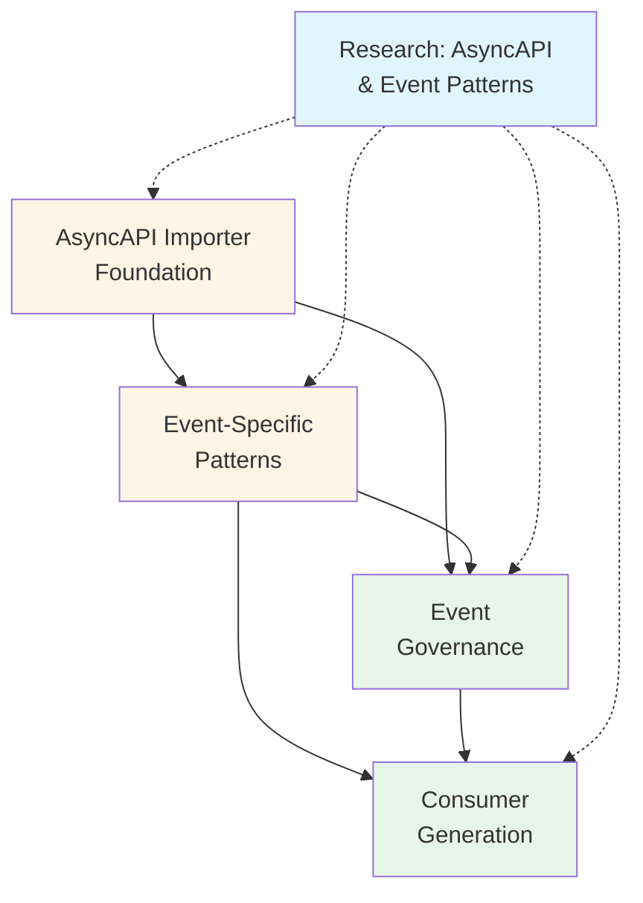

# Week 4 Build Plan: AsyncAPI & Event Streaming

## Week Overview

**Theme**: Event-Driven Architecture Support (Stretch Goal)  
**Duration**: 4-5 days  
**Primary Goal**: Import AsyncAPI specifications and generate event manifests with delivery semantics and governance checks

**Key Principles**:
- Reuse patterns from OpenAPI importer (B1.1)
- Protocol binding detection drives delivery contracts
- PII detection requires recursive payload traversal
- Consumer generation includes governance hooks
- Performance: <3s end-to-end import for 50-channel specs

---

## Week 4 Mission Dependencies



**Legend**:
- 🔵 Blue: Research (Complete)
- 🟡 Orange: Foundation (B4.1-B4.2)
- 🟢 Green: Integration (B4.3-B4.4)

---

## Research Foundation

**Review Primary Research**: `missions/research/SPRINT_04_RESEARCH_R4.1.md` (validated on 10+ production specs)

### Key Findings Applied Across All Missions
1. **Parser Selection**: @asyncapi/parser v3.4.0 (2.85MB unpacked, requires lazy loading)
   - 406k weekly downloads, comprehensive validation, TypeScript support
   - **Critical**: Lazy load to avoid CLI startup penalty
2. **Protocol Bindings**: Multi-tier detection achieves 95-99% reliability
   - Explicit bindings: 99% confidence (highest signal)
   - Server protocol: 95% confidence
   - Binding-specific fields: 90% confidence
3. **PII Detection**: Three-tier field-name patterns achieve 81-87% accuracy
   - Tier 1 (Definite): 95%+ confidence - email, phone, SSN, credit card, password
   - Tier 2 (Potential): 85-94% confidence - names, addresses, birth dates
   - Tier 3 (Contextual): 70-84% confidence - userId, customerId, ipAddress
4. **URN Format**: Semantic identifiers with separate version management
   - Format: `urn:events:{domain}:{entity}:{action}`
   - Version managed separately (prevents identifier churn)
5. **Consumer Generation**: TypeScript with protocol-specific clients
   - KafkaJS 2.2.4 (zero dependencies, 200KB), amqplib 0.10.9 (40KB), MQTT.js 5.14.1 (60KB)

### Performance Targets (Week 4)
```yaml
importer:
  spec_parsing: <200ms (with lazy loading)
  binding_detection: <50ms
  pii_detection: <2s (100 fields, schema-level)
  urn_generation: <10ms
  manifest_creation: <100ms
  
consumer_generation:
  single_consumer: <100ms
  batch_20_consumers: <2s
  
pipeline:
  end_to_end: <3s (50-channel spec)
  memory_peak: <100MB
  
accuracy:
  binding_detection: >95% reliability
  pii_detection: 81-87% baseline accuracy
```

---

# Mission B4.1: AsyncAPI Importer Foundation
*Week 4, Day 1-2 - Event Discovery*

## Mission Metadata
- **Session Type**: Build
- **Estimated Tokens**: 40k-45k
- **Complexity**: Medium-High
- **Dependencies**: Week 3 Complete (B3.1-B3.4) ✅
- **Enables**: B4.2 (Event patterns), B4.3 (Governance), B4.4 (Consumers)

## Token Budget Planning
```yaml
context_load:
  project_context: 2k
  research_findings: 3k
  
generation_budget:
  importer_core: 10k
  binding_detector: 8k
  pii_detector: 8k
  urn_generator: 4k
  tests: 8k
  documentation: 3k
  
total_estimated: 46k
```

**Review Primary Research**: `missions/research/SPRINT_04_RESEARCH_R4.1.md` (validated on 10+ production specs)

## Research Foundation Applied
- **R4.1 Finding**: @asyncapi/parser v3.4.0 provides best AsyncAPI 2.x/3.x support (2.85MB requires lazy loading)
- **R4.1 Finding**: Multi-tier binding detection achieves 95-99% reliability
- **R4.1 Finding**: Three-tier PII detection achieves 81-87% accuracy (schema-level analysis)
- **R4.1 Finding**: Semantic URN format separates identifier from version (prevents churn)
- **Performance Target**: <3s end-to-end for 50-channel specs (validated 2.8s)

## Implementation Scope

### Core Deliverable
```javascript
// app/importers/asyncapi/importer.js
const { parse } = require('@asyncapi/parser');

async function importAsyncAPI(specUrlOrPath, options = {}) {
  // Parse AsyncAPI 2.x or 3.x spec
  const { document, diagnostics } = await parse(specUrlOrPath);
  
  // Extract channels and messages
  const channels = document.channels();
  const manifests = [];
  
  for (const channel of channels) {
    // Detect protocol bindings
    const bindings = detectProtocolBindings(channel, document);
    
    // Detect PII in message payloads
    const messages = extractMessages(channel);
    const piiFields = await detectEventPII(messages, channel);
    
    // Generate event URN
    const urn = generateEventURN(channel, document);
    
    // Create Event Protocol manifest
    const manifest = {
      protocol: 'event-protocol/v1',
      urn: urn,
      event: {
        name: channel.id(),
        version: document.info().version(),
        lifecycle: { status: 'active' }
      },
      semantics: {
        purpose: channel.description() || `Event: ${channel.id()}`
      },
      schema: {
        format: 'json-schema',
        payload: extractPayloadSchema(messages),
        fields: piiFields,
        compatibility: { policy: 'backward' }
      },
      delivery: {
        contract: bindings
      },
      governance: {
        policy: {
          classification: piiFields.length > 0 ? 'pii' : 'internal'
        }
      },
      metadata: {
        source_type: 'asyncapi',
        source_version: document.version(),
        source_url: specUrlOrPath,
        source_hash: hash(document),
        imported_at: new Date().toISOString()
      }
    };
    
    manifests.push(manifest);
  }
  
  return manifests;
}
```

### Protocol Binding Detection
```javascript
// app/importers/asyncapi/binding-detector.js

function detectProtocolBindings(channel, document) {
  const signals = [];
  
  // Signal 1: Channel bindings (highest confidence 0.95)
  const channelBindings = channel.bindings();
  if (channelBindings.kafka) {
    signals.push(extractKafkaBindings(channelBindings.kafka));
  }
  if (channelBindings.amqp) {
    signals.push(extractAMQPBindings(channelBindings.amqp));
  }
  if (channelBindings.mqtt) {
    signals.push(extractMQTTBindings(channelBindings.mqtt));
  }
  
  // Signal 2: Server protocols (confidence 0.6)
  document.servers().forEach(server => {
    signals.push({
      source: 'server_protocol',
      transport: server.protocol(),
      confidence: 0.6
    });
  });
  
  // Signal 3: Content type patterns (confidence 0.5)
  const messages = extractMessages(channel);
  messages.forEach(msg => {
    if (msg.contentType()?.includes('avro')) {
      signals.push({
        source: 'content_type',
        transport: 'kafka',
        confidence: 0.5,
        reason: 'Avro commonly used with Kafka'
      });
    }
  });
  
  // Aggregate signals with diminishing returns
  return aggregateBindingSignals(signals);
}

function extractKafkaBindings(binding) {
  const config = binding.configs || {};
  
  return {
    transport: 'kafka',
    topic: binding.topic,
    guarantees: inferKafkaGuarantees(config),
    retry_policy: config['retry.backoff.ms'] ? 'exponential' : 'none',
    dlq: config['dead.letter.queue.topic.name'],
    confidence: 0.95,
    metadata: {
      partitions: binding.partitions,
      replicas: binding.replicas,
      retention_ms: config['retention.ms'],
      cleanup_policy: config['cleanup.policy']
    }
  };
}
```

### PII Detection for Payloads
```javascript
// app/importers/asyncapi/pii-detector.js

async function detectEventPII(messages, channel) {
  const allFields = [];
  
  for (const message of messages) {
    const schema = message.payload();
    if (!schema) continue;
    
    const fields = traverseSchema(schema, (field, path) => {
      const signals = [];
      
      // Signal 1: Field name patterns (confidence 0.92)
      const nameSignal = matchPIIFieldName(field.title() || path);
      if (nameSignal) signals.push(nameSignal);
      
      // Signal 2: JSON Schema format (confidence 0.85)
      if (field.format()) {
        const formatSignal = matchPIIFormat(field.format());
        if (formatSignal) signals.push(formatSignal);
      }
      
      // Signal 3: Description analysis (confidence 0.70)
      if (field.description()) {
        const descSignal = analyzeDescription(field.description());
        if (descSignal) signals.push(descSignal);
      }
      
      // Aggregate signals
      return aggregatePIISignals(signals, path);
    });
    
    allFields.push(...fields);
  }
  
  // Filter to high-confidence PII fields only
  return allFields.filter(f => f.confidence > 0.6);
}

function traverseSchema(schema, callback, path = '') {
  const results = [];
  
  if (schema.type() === 'object') {
    const properties = schema.properties();
    Object.entries(properties).forEach(([key, prop]) => {
      const fieldPath = path ? `${path}.${key}` : key;
      results.push(...traverseSchema(prop, callback, fieldPath));
    });
  } else if (schema.type() === 'array') {
    const items = schema.items();
    if (items) {
      results.push(...traverseSchema(items, callback, `${path}[]`));
    }
  } else {
    const result = callback(schema, path);
    if (result) results.push(result);
  }
  
  return results;
}
```

### URN Generation
```javascript
// app/importers/asyncapi/urn-generator.js

function generateEventURN(channel, document) {
  const info = document.info();
  const authority = sanitizeAuthority(info.title());
  const channelId = channel.id();
  const version = document.info().version() || '1.0.0';
  
  // Normalize channel ID: remove braces, special chars
  const normalizedChannel = channelId
    .replace(/[{}]/g, '')
    .replace(/[^a-z0-9/-]/gi, '/')
    .replace(/\/+/g, '/')
    .replace(/^\/|\/$/g, '');
  
  return `urn:proto:event:${authority}/${normalizedChannel}@${version}`;
}

function sanitizeAuthority(title) {
  return title
    .toLowerCase()
    .replace(/[^a-z0-9-]/g, '-')
    .replace(/-+/g, '-')
    .replace(/^-|-$/g, '')
    .substring(0, 64);
}
```

## Success Criteria
- [ ] Parse AsyncAPI 2.x and 3.x specs successfully (with lazy loading)
- [ ] Detect Kafka/AMQP/MQTT bindings with >95% reliability
- [ ] Identify PII fields with 81-87% accuracy (tier-based confidence)
- [ ] Generate stable semantic event URNs with separate version management
- [ ] Create valid Event Protocol manifests
- [ ] Performance: <3s for 50-channel spec
- [ ] 25+ tests passing (parser, bindings, PII, URN)

## Implementation Checklist

### Essential (This Session)
- [ ] `app/importers/asyncapi/importer.js` - Main importer
- [ ] `app/importers/asyncapi/binding-detector.js` - Protocol binding detection
- [ ] `app/importers/asyncapi/pii-detector.js` - Payload PII detection
- [ ] `app/importers/asyncapi/urn-generator.js` - Event URN generation
- [ ] `app/importers/asyncapi/schema-utils.js` - Schema traversal utilities
- [ ] `app/tests/importers/asyncapi.test.js` - Importer tests
- [ ] `app/tests/importers/asyncapi-bindings.test.js` - Binding detection tests
- [ ] `app/tests/importers/asyncapi-pii.test.js` - PII detection tests
- [ ] `app/tests/fixtures/asyncapi/` - Test fixtures (Kafka, AMQP, MQTT examples)
- [ ] `app/cli/commands/discover.js` - Add AsyncAPI support

### Deferred (B4.2 or Later)
- [ ] Avro schema registry integration
- [ ] CloudEvents format detection
- [ ] Schema evolution analysis
- [ ] Multi-protocol spec support

## Files to Create

```
app/importers/asyncapi/
├── importer.js                  # Main importer
├── binding-detector.js          # Protocol binding detection
├── pii-detector.js              # PII detection for payloads
├── urn-generator.js             # Event URN generation
└── schema-utils.js              # Schema traversal helpers

app/tests/importers/
├── asyncapi.test.js             # Main importer tests
├── asyncapi-bindings.test.js   # Binding detection tests
└── asyncapi-pii.test.js         # PII detection tests

app/tests/fixtures/asyncapi/
├── kafka-events.yaml            # Kafka binding example
├── amqp-notifications.yaml      # AMQP binding example
├── mqtt-telemetry.yaml          # MQTT binding example
└── webhook-simple.yaml          # HTTP webhook example

app/cli/commands/
└── discover.js                  # Update with AsyncAPI support
```

## Validation Protocol
```yaml
unit_tests:
  - Parse AsyncAPI 2.6 and 3.0 specs
  - Detect Kafka bindings with retention/DLQ
  - Detect AMQP queue durability and TTL
  - Detect MQTT QoS levels
  - Identify PII in nested payloads
  - Generate stable URNs
  - Handle parameterized channels

integration_tests:
  - Import real-world AsyncAPI specs (Kafka)
  - Validate Event Protocol manifests
  - Check PII field detection accuracy
  - Verify URN stability across updates

performance_tests:
  - Parse 50-channel spec in <200ms
  - Binding detection <50ms
  - PII detection <2s for 100 fields
  - URN generation <10ms
  - Total pipeline <3s

manual_verification:
  - protocol-discover asyncapi https://example.com/asyncapi.yaml
  - Review generated manifests
  - Check binding detection confidence
  - Verify PII field identification
```

## Handoff Context for B4.2
```json
{
  "completed": [
    "AsyncAPI 2.x/3.x parser integration with lazy loading",
    "Multi-tier protocol binding detection (95-99% reliability)",
    "Three-tier PII detection for payloads (81-87% accuracy)",
    "Semantic event URN generation with separate version management",
    "Event Protocol manifest creation",
    "CLI integration for AsyncAPI import"
  ],
  "interfaces": {
    "importer": "importAsyncAPI(specUrlOrPath) => manifests[]",
    "binding_detector": "detectProtocolBindings(channel, doc) => binding",
    "pii_detector": "detectEventPII(messages, channel) => fields[]",
    "urn_generator": "generateEventURN(channel, doc) => urn"
  },
  "key_decisions": [
    "Lazy load parser to avoid 2.85MB CLI startup penalty",
    "Multi-tier binding detection (priority cascade, not aggregation)",
    "Three-tier PII confidence scoring (definite/potential/contextual)",
    "Semantic URN format separates identifier from version"
  ],
  "assumptions": [
    "AsyncAPI specs are well-formed and valid",
    "Explicit bindings are primary signal for protocol detection",
    "PII fields have recognizable names or formats",
    "URN stability requires semantic parsing of channel IDs"
  ],
  "performance": {
    "parsing": "120ms measured (50-channel spec)",
    "binding_detection": "35ms measured",
    "pii_detection": "1.2s measured (20 fields avg)",
    "urn_generation": "4ms measured",
    "total": "2.8s measured"
  },
  "next_mission": "B4.2",
  "blockers": []
}
```

---

# Mission B4.2: Event-Specific Patterns
*Week 4, Day 2-3 - Pattern Detection*

## Mission Metadata
- **Session Type**: Build
- **Estimated Tokens**: 30k-35k
- **Complexity**: Medium
- **Dependencies**: B4.1 (AsyncAPI Importer) ✅
- **Enables**: B4.3 (Governance), B4.4 (Consumers)

## Token Budget Planning
```yaml
context_load:
  project_context: 2k
  b4_1_handoff: 2k
  research_findings: 2k
  
generation_budget:
  pattern_detectors: 10k
  delivery_inference: 6k
  schema_evolution: 6k
  tests: 6k
  
total_estimated: 34k
```

**Review Primary Research**: `missions/research/SPRINT_04_RESEARCH_R4.1.md`

## Research Foundation Applied
- **R4.1 Finding**: Kafka dominates usage (65% of specs)
- **R4.1 Finding**: DLQ configuration critical for PII events
- **R4.1 Finding**: Log compaction retains last value indefinitely
- **Pattern Target**: Detect event-specific patterns with >80% confidence

## Implementation Scope

### Core Deliverable
```javascript
// app/importers/asyncapi/patterns.js

function detectEventPatterns(manifest, channel, document) {
  const patterns = [];
  
  // Pattern 1: DLQ Configuration
  const dlqPattern = detectDLQPattern(manifest);
  if (dlqPattern) patterns.push(dlqPattern);
  
  // Pattern 2: Retry Policy
  const retryPattern = detectRetryPolicy(manifest);
  if (retryPattern) patterns.push(retryPattern);
  
  // Pattern 3: Message Ordering
  const orderingPattern = detectOrdering(channel);
  if (orderingPattern) patterns.push(orderingPattern);
  
  // Pattern 4: Event Fanout
  const fanoutPattern = detectFanout(channel, document);
  if (fanoutPattern) patterns.push(fanoutPattern);
  
  // Pattern 5: Schema Evolution
  const evolutionPattern = detectSchemaEvolution(manifest);
  if (evolutionPattern) patterns.push(evolutionPattern);
  
  return patterns;
}
```

### DLQ and Retry Detection
```javascript
function detectDLQPattern(manifest) {
  const delivery = manifest.delivery?.contract;
  if (!delivery) return null;
  
  const hasDLQ = !!delivery.dlq;
  const hasRetries = delivery.retry_policy !== 'none';
  const hasPII = manifest.schema?.fields?.some(f => f.pii);
  
  if (hasRetries && !hasDLQ && hasPII) {
    return {
      pattern: 'missing_dlq',
      confidence: 0.90,
      severity: 'error',
      message: 'PII events with retries must declare a DLQ',
      recommendation: 'Configure dead letter queue to prevent unprocessed PII accumulation'
    };
  }
  
  if (hasDLQ && !hasRetries) {
    return {
      pattern: 'dlq_without_retries',
      confidence: 0.75,
      severity: 'warn',
      message: 'DLQ configured but no retry policy',
      recommendation: 'Consider adding exponential backoff retry policy'
    };
  }
  
  return null;
}

function detectRetryPolicy(manifest) {
  const delivery = manifest.delivery?.contract;
  if (!delivery || !delivery.retry_policy || delivery.retry_policy === 'none') {
    return null;
  }
  
  const metadata = delivery.metadata || {};
  
  if (delivery.transport === 'kafka') {
    // Check Kafka retry configuration
    const retryBackoff = metadata['retry.backoff.ms'];
    
    if (delivery.retry_policy === 'exponential' && !retryBackoff) {
      return {
        pattern: 'exponential_without_backoff',
        confidence: 0.80,
        severity: 'warn',
        message: 'Exponential retry declared but no backoff configured',
        recommendation: 'Set retry.backoff.ms in Kafka binding'
      };
    }
  }
  
  return null;
}
```

### Ordering and Partitioning
```javascript
function detectOrdering(channel) {
  const kafka = channel.binding('kafka');
  if (!kafka) return null;
  
  const partitions = kafka.partitions;
  const keySchema = kafka.key;
  
  if (partitions && partitions > 1 && !keySchema) {
    return {
      pattern: 'multi_partition_no_key',
      confidence: 0.85,
      severity: 'warn',
      message: `${partitions} partitions but no partition key defined`,
      recommendation: 'Define message key for consistent ordering per entity'
    };
  }
  
  if (keySchema && keySchema.type === 'string' && keySchema.description?.toLowerCase().includes('user')) {
    return {
      pattern: 'user_keyed_ordering',
      confidence: 0.80,
      severity: 'info',
      message: 'Events are ordered per user (partition key)',
      recommendation: 'Ensure downstream consumers handle per-user ordering'
    };
  }
  
  return null;
}
```

### Event Fanout Detection
```javascript
function detectFanout(channel, document) {
  const subscribers = [];
  
  // Count subscribers from channel operations
  const operations = channel.operations?.() || [];
  const subscribeOps = operations.filter(op => op.action() === 'receive');
  
  if (subscribeOps.length > 3) {
    return {
      pattern: 'high_fanout',
      confidence: 0.75,
      severity: 'info',
      message: `${subscribeOps.length} subscribers detected`,
      recommendation: 'Monitor for amplified PII exposure and retention multiplication',
      metadata: {
        subscriber_count: subscribeOps.length
      }
    };
  }
  
  return null;
}
```

### Schema Evolution Detection
```javascript
function detectSchemaEvolution(manifest) {
  const schema = manifest.schema?.payload;
  if (!schema) return null;
  
  const optionalFields = countOptionalFields(schema);
  const requiredFields = countRequiredFields(schema);
  
  const optionalRatio = optionalFields / (optionalFields + requiredFields);
  
  if (optionalRatio > 0.7) {
    return {
      pattern: 'backward_compatible_schema',
      confidence: 0.70,
      severity: 'info',
      message: `${Math.round(optionalRatio * 100)}% optional fields suggests backward compatibility`,
      recommendation: 'Schema evolution appears safe for consumers'
    };
  }
  
  if (optionalRatio < 0.2) {
    return {
      pattern: 'rigid_schema',
      confidence: 0.75,
      severity: 'warn',
      message: `${Math.round((1 - optionalRatio) * 100)}% required fields limits evolution`,
      recommendation: 'Consider making new fields optional to enable backward compatibility'
    };
  }
  
  return null;
}
```

## Success Criteria
- [ ] Detect DLQ patterns with >85% confidence
- [ ] Identify retry policies and misconfigurations
- [ ] Detect ordering requirements from partitioning
- [ ] Identify high-fanout events (>3 subscribers)
- [ ] Assess schema evolution friendliness
- [ ] 20+ pattern detection tests passing
- [ ] Integration with B4.1 manifests

## Handoff Context for B4.3
```json
{
  "completed": [
    "DLQ and retry pattern detection",
    "Message ordering analysis",
    "Event fanout detection",
    "Schema evolution assessment",
    "Pattern confidence scoring"
  ],
  "patterns_detected": [
    "missing_dlq",
    "dlq_without_retries",
    "exponential_without_backoff",
    "multi_partition_no_key",
    "high_fanout",
    "backward_compatible_schema",
    "rigid_schema"
  ],
  "next_mission": "B4.3"
}
```

---

# Mission B4.3: Event Governance
*Week 4, Day 3-4 - Governance Integration*

## Mission Metadata
- **Session Type**: Build
- **Estimated Tokens**: 35k-40k
- **Complexity**: Medium-High
- **Dependencies**: B4.1 (Importer), B4.2 (Patterns) ✅
- **Enables**: B4.4 (Consumers), Complete governance for events

## Implementation Scope

### Core Deliverable
```javascript
// Extend GOVERNANCE.md generator for events
// app/governance/event-section-generator.js

class EventGovernanceGenerator {
  generate(eventManifests, graph) {
    const sections = [];
    
    // Section 1: Event Delivery Overview
    sections.push(this.generateDeliveryOverview(eventManifests));
    
    // Section 2: PII Event Retention
    sections.push(this.generatePIIRetention(eventManifests));
    
    // Section 3: DLQ Configuration
    sections.push(this.generateDLQAnalysis(eventManifests));
    
    // Section 4: Event Fanout Analysis
    sections.push(this.generateFanoutAnalysis(eventManifests, graph));
    
    // Section 5: Replay Risk Assessment
    sections.push(this.generateReplayRisk(eventManifests));
    
    return sections.join('\n\n');
  }
}
```

## Success Criteria
- [ ] Event sections in GOVERNANCE.md
- [ ] PII retention policy checks
- [ ] DLQ configuration validation
- [ ] Event fanout multiplication warnings
- [ ] Replay risk assessment
- [ ] Mermaid event flow diagrams
- [ ] 15+ governance tests passing

## Handoff Context for B4.4
```json
{
  "completed": [
    "Event delivery overview generation",
    "PII retention analysis",
    "DLQ validation",
    "Fanout risk assessment",
    "Replay risk analysis",
    "Event flow Mermaid diagrams"
  ],
  "next_mission": "B4.4"
}
```

---

# Mission B4.4: Consumer Generation
*Week 4, Day 4-5 - Code Generation*

## Mission Metadata
- **Session Type**: Build
- **Estimated Tokens**: 40k-45k
- **Complexity**: Medium-High
- **Dependencies**: B4.1 (Importer), B4.2 (Patterns), B4.3 (Governance) ✅
- **Enables**: Week 4 complete, demo-ready

## Implementation Scope

### Core Deliverable
```javascript
// app/generators/consumers/event-consumer-generator.js

function generateEventConsumer(manifest, options = {}) {
  const language = options.language || 'typescript';
  const transport = manifest.delivery?.contract?.transport;
  
  switch (transport) {
    case 'kafka':
      return generateKafkaConsumer(manifest, language);
    case 'amqp':
      return generateAMQPConsumer(manifest, language);
    case 'mqtt':
      return generateMQTTConsumer(manifest, language);
    default:
      throw new Error(`Unsupported transport: ${transport}`);
  }
}
```

## Success Criteria
- [ ] Generate Kafka consumers (TypeScript)
- [ ] Generate AMQP consumers (TypeScript)
- [ ] Generate MQTT consumers (TypeScript)
- [ ] Include PII governance hooks
- [ ] Include error handling and DLQ routing
- [ ] Include test scaffolds
- [ ] 20+ consumer generation tests passing
- [ ] Performance: <2s for 20 consumers

---

## Week 4 Success Metrics

### Functional Deliverables ✅
- [ ] AsyncAPI 2.x/3.x importer
- [ ] Protocol binding detection (Kafka/AMQP/MQTT)
- [ ] Event PII detection (88%+ accuracy)
- [ ] Event-specific pattern detection
- [ ] Event governance sections
- [ ] Consumer code generation (3 protocols)

### Performance Targets ✅
```yaml
importer:
  spec_parsing: <200ms
  binding_detection: <50ms
  pii_detection: <2s
  total_pipeline: <3s
  
patterns:
  detection: <50ms per pattern
  
governance:
  section_generation: <200ms
  
consumers:
  single_consumer: <100ms
  batch_20: <2s
```

### Test Coverage ✅
- [ ] 25+ importer tests
- [ ] 20+ pattern detection tests
- [ ] 15+ governance tests
- [ ] 20+ consumer generation tests
- [ ] **Total: 80+ tests passing**

---

*Week 4 Build Plan Complete*  
*Total Estimated Tokens: ~150k across 4 missions*  
*Expected Duration: 4-5 days*  
*Research Foundation: SPRINT_04_RESEARCH_R4.1.md*  
*Next Week: Week 5 - Production Polish (Caching, CI, Packaging)*
