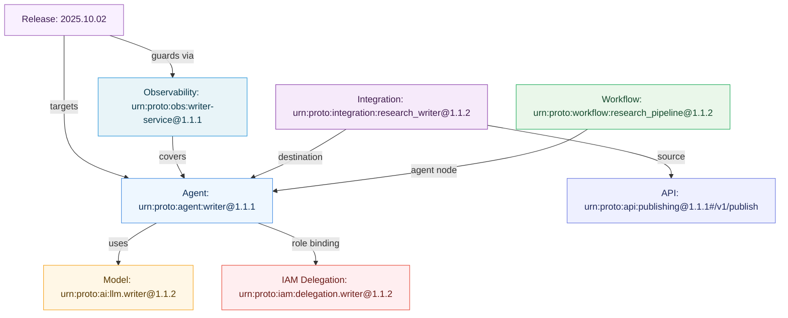

# Agent Protocol v1.1.1 — Documentation Page

> Doc ID: `docs.agent.protocol.v1.1.1`

## Overview
The **Agent Protocol** extends the v1.1.1 family with a minimal, manifest‑first approach for describing autonomous agents. It provides:

- **Identity & Discovery** — who the agent is, where to find its card.
- **Capabilities** — tools, resources, prompts, modalities.
- **Communication** — supported protocols (A2A, MCP, custom) and endpoints.
- **Authorization** — whether delegation is supported, with signature scheme.
- **Relationships** — URN links to models, APIs, workflows, IAM roles, observability targets.

## Navigation
- [Agent Protocol Manifest](#agent-protocol-manifest)
- [Workflow Nodes (v1.1.2)](#workflow-nodes)
- [AI/ML Context Capabilities (v1.1.2)](#aiml-context-capabilities)
- [IAM Delegation (v1.1.2)](#iam-delegation)
- [Integration Agent Mapping (v1.1.2)](#integration-agent-mapping)
- [Examples](#examples)

## Agent Protocol Manifest
```yaml
apiVersion: agent/v1.1.1
kind: AgentManifest
agent:
  id: research
  name: Research Agent
  version: 1.1.1
  discovery_uri: https://agents.example.com/research/.well-known/agent.json
capabilities:
  tools:
    - name: search_papers
      description: "Search academic papers"
      urn: urn:proto:agent:research@1.1.1#tool.search_papers
communication:
  supported: [a2a, mcp]
authorization:
  delegation_supported: true
  signature_algorithm: ES256
relationships:
  models: [urn:proto:ai:gpt4@1.1.1]
  workflows: [urn:proto:workflow:research_pipeline@1.1.2]
```

## Workflow Nodes
Workflow v1.1.2 adds support for `type: agent` nodes. These delegate tasks to agents declared in Agent Protocol manifests.

```yaml
- id: write
  type: agent
  agent:
    urn: urn:proto:agent:writer@1.1.1
    protocol: a2a
    skill: write_article
    inputMapping:
      research: ${node.research.outputs.summary}
    delegation:
      urn: urn:proto:iam:delegation.writer@1.1.2
```

## AI/ML Context Capabilities
AI/ML v1.1.2 adds `contextCapabilities` so models can advertise tool, resource, and prompt access aligned with the Agent Protocol.

```yaml
contextCapabilities:
  tools:
    - name: search_corpus
      urn: urn:proto:agent:writer@1.1.1#tool.search_corpus
  resources:
    - uri: file://repo
      urn: urn:proto:agent:writer@1.1.1#res.repo
```

## IAM Delegation
IAM v1.1.2 introduces `DelegationManifest` for agent authorization.

```yaml
apiVersion: iam/v1.1.2
kind: DelegationManifest
principal: { urn: urn:proto:iam:user@1.1.1#u123 }
delegate:  { urn: urn:proto:agent:writer@1.1.1 }
authorization:
  scope: content.create
  constraints:
    - type: budget
      maxAmount: 500
      currency: USD
```

## Integration Agent Mapping
Integration v1.1.2 supports `agentMapping` for conversation context and artifact mapping.

```yaml
agentMapping:
  conversationContext: { enabled: true, preserveHistory: true }
  artifactMapping:
    - sourceArtifact: research_summary
      destinationInput: research
      transformation:
        type: jsonpath
        rules:
          research: $.summary
```

## Relationship Graph


## Examples
- [Agent Manifest (Writer Agent)](./agent-writer.yaml)
- [Workflow with Agent Node](./workflow-research-pipeline.yaml)
- [AI/ML Model with Context Capabilities](./aiml-writer.yaml)
- [IAM Delegation Manifest](./iam-delegation-writer.yaml)
- [Integration Mapping](./integration-research-writer.yaml)
- [Observability Targeting Agent](./obs-writer.yaml)
- [Release Covering Agent](./release-2025-10-02.yaml)

---
**Maintainer**: `platform/ai`

**Tags**: `agent`, `protocol`, `integration`, `delegation`, `workflow`

