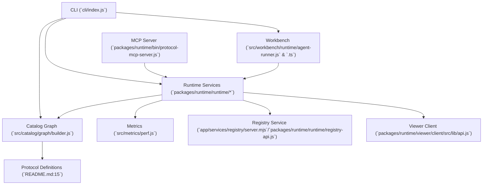

# Mission Completion Report — mission-20251015-153127-839

## Metadata
- Assessment date: 2025-10-18
- Repository scope: OSS Protocols (`/Users/d/portfolio/OSSP-AGI`)
- Toolkit versions: Node ≥18 per engines (`package.json:49`), CLI entrypoint `cli/index.js:15`

## Executive Summary
- The suite ships 18 protocol definitions with a shared CLI and MCP server that orchestrate catalog, workbench, and discovery workflows (`README.md:15`, `cli/index.js:15`, `packages/runtime/bin/protocol-mcp-server.js:55`, `src/catalog/graph/builder.js:1`).
- Quality guardrails are weakened by 17 failing Jest suites and 49.18% line coverage; critical CLI/security modules never execute under tests (`README.md:164`, `coverage/coverage-summary.json:1`, `coverage/coverage-summary.json:13`).
- Performance instrumentation is present, yet metrics fall back to seeded data whenever logs are missing, creating governance risk for SLO decisions (`app/cli/perf-status.mjs:7`, `docs/dev/observability.md:205`, `src/metrics/perf.js:177`).
- Security enforcement remains permissive: signature policy disables verification, registry and delegation flows are mocked, and runtime checks log rather than block operations (`app/config/security/signature-policy.json:1`, `packages/runtime/runtime/registry-api.js:285`, `packages/runtime/src/agents/runtime.js:44`, `app/config/security/delegation-policy.json:1`).
- Documentation breadth is strong but stale—governance stats cite only three protocols while README still advertises “480+ tests”; scaffold artifacts include TODO-heavy generators that risk roadmap confusion (`GOVERNANCE.md:6`, `README.md:156`, `artifacts/scaffold-smoke/api-1760379289706/importers/smoke-api-1760379289706-importer.js:16`).

## Architecture Overview

- CLI wraps Commander commands for perf status, catalog browsing, theming, and workbench orchestration (`cli/index.js:15`).
- Runtime services expose URN resolution, discovery, and registry APIs, but the registry HTTP server remains a mocked setTimeout stub while URN discovery returns canned data (`packages/runtime/bin/protocol-mcp-server.js:55`, `packages/runtime/runtime/registry-api.js:285`, `packages/runtime/runtime/urn-resolver.js:153`).
- Catalog builder ingests manifests into a property graph with validation and metadata counts, backing visualization and governance tooling (`src/catalog/graph/builder.js:1`, `artifacts/catalog-graph.json:210`).
- Workbench runtime simulates API/Event/Data agents to validate workflow latency budgets; benchmarks feed CI artifacts (`src/workbench/runtime/agent-runner.js:67`, `docs/dev/workbench-overview.md:5`, `reports/workbench/perf-results.json:1`).
- Viewer client APIs still return placeholders for validation, graphs, and governance, blocking end-user diagnostics (`packages/runtime/viewer/client/src/lib/api.js:143`).

## Current Capabilities & Feature Inventory
| Category | Feature | Evidence | Usage / Notes |
| --- | --- | --- | --- |
| Core | Protocol suite & validators | `README.md:15` | 18 protocol modules; sample catalog graph shows 6 manifests and 11 edges generated 2025-10-14 (`artifacts/catalog-graph.json:210`). |
| Core | Catalog CLI & graph builder | `cli/index.js:35`, `src/catalog/graph/builder.js:1` | CLI supports list/view/diagram generation while builder enforces schema validation and records counts (`artifacts/catalog-graph.json:214`). |
| Core | MCP server & tools | `packages/runtime/bin/protocol-mcp-server.js:94` | Tools cover remote/local OpenAPI discovery and test listing; metrics endpoint wraps each handler. |
| Supporting | Integration workbench | `docs/dev/workbench-overview.md:5`, `src/workbench/runtime/agent-runner.js:67` | Latest benchmark: 5 runs, avg 184ms, p95 205ms, max concurrency 2 (`reports/workbench/perf-results.json:1`). |
| Supporting | Observability & perf budgets | `app/cli/perf-status.mjs:7`, `src/metrics/perf.js:65`, `docs/dev/observability.md:205` | CLI summarises p50/p95, budgets default to discovery<1s & MCP<3s; SLO doc reports 892 ms / 2.4 s compliance. |
| Supporting | Security tooling | `cli/commands/security-scan.js:18`, `app/cli/security-verify.mjs:59` | Security scan supports secret/license/vuln policies; signature verify scans `.sig.json` but relies on permissive policy (`app/config/security/signature-policy.json:1`). |
| Incomplete | Registry API mock | `packages/runtime/runtime/registry-api.js:285` | HTTP server is simulated with `setTimeout`; real Express server exists only under `app/services/registry/server.mjs:1`. |
| Incomplete | Viewer front-end | `packages/runtime/viewer/client/src/lib/api.js:143` | Validation, graph, and governance routes return placeholder payloads and TODO markers. |
| Incomplete | Scaffold smoke generators | `artifacts/scaffold-smoke/api-1760379289706/importers/smoke-api-1760379289706-importer.js:16`, `artifacts/scaffold-smoke/api-1760379289706/tests/smoke-api-1760379289706-importer.test.js:21` | Generated importers and tests are stubs (TODOs, trivial asserts) and include incorrect class names. |

## Technical Debt & Risk Log
| Severity | Risk | Evidence | Impact | Roadmap Focus |
| --- | --- | --- | --- | --- |
| High | 17 failing suites & 49% coverage | `README.md:164`, `coverage/coverage-summary.json:1`, `coverage/coverage-summary.json:13` | Failing CI gates; unsigned CLI paths never exercised in tests. | Stabilize test runs, expand coverage for CLI/security utilities. |
| High | Mocked integration surfaces | `packages/runtime/runtime/registry-api.js:285`, `packages/runtime/runtime/urn-resolver.js:153`, `packages/runtime/src/agents/runtime.js:44` | Production behaviour diverges from mocks; catalog resolution and registry flows unverified. | Replace mocks with real services or contract tests before roadmap expansion. |
| High | Signature & delegation enforcement disabled | `app/config/security/signature-policy.json:1`, `app/config/security/delegation-policy.json:1`, `app/cli/security-verify.mjs:60` | Supply-chain protections cannot fail builds; delegations always succeed. | Enforce signatures & tighten delegation policies before external partner onboarding. |
| Medium | Synthetic perf metrics on missing logs | `src/metrics/perf.js:177`, `src/metrics/perf.js:200` | Seeded random data can mask regressions, undermining perf budgets. | Require real artifact ingestion prior to seeding, surface warning in CLI/CI. |
| Medium | Viewer & CLI security tools untested | `packages/runtime/viewer/client/src/lib/api.js:143`, `coverage/coverage-summary.json:279`, `app/cli/sign.mjs:9`, `coverage/coverage-summary.json:13` | UI endpoints and signing flows may regress undetected. | Add targeted tests & coverage thresholds for UI/crypto utilities. |
| Medium | TypeScript orchestrator not built | `src/workbench/runtime/orchestrator.ts:1` | .ts version contains types/interfaces but is unreconciled with runtime, inviting drift. | Consolidate to single source or add build step to keep parity. |
| Low | Generated scaffolds with TODO & naming bugs | `artifacts/scaffold-smoke/api-1760379289706/tests/smoke-api-1760379289706-importer.test.js:8` | New contributors may rely on broken samples; noise in repo. | Categorize as experimental or clean up prior to broader release. |

## Performance & Scalability
- Latest `node cli/index.js perf:status --format json --workspace .` (2025-10-18) reported discovery p95 = 878.72 ms with 62% cache hits and MCP p95 = 2405.78 ms, aligned with default CI budgets of 1 s/3 s (`app/cli/perf-status.mjs:7`, `scripts/ci/perf-budget.js:23`).
- Workbench benchmark artifacts show 5 deterministic runs averaging 184 ms, p95 205 ms, max concurrency 2 (`reports/workbench/perf-results.json:1`).
- Perf budgets for WSAP, CLI, and MCP are versioned configs (e.g., CLI p95 ≤ 2500 ms) stored under `app/config/perf-budgets.json:1`.
- Metrics collector seeds random data whenever artifacts are missing or empty, potentially masking regressions in non-CI environments (`src/metrics/perf.js:177`, `src/metrics/perf.js:232`).
- SLO documentation establishes discovery <1 s and MCP <3 s targets, with current values recorded as 892 ms / 2.4 s (`docs/dev/observability.md:205`).
- Limitation: No production telemetry beyond JSONL artifacts in `artifacts/perf/`; validation relies on local runs and seeded fallbacks (`artifacts/perf/latest.jsonl:1`, `src/metrics/perf.js:200`).

## Security Posture
- `npm audit --json` (2025-10-18) reports zero known vulnerabilities; direct dependencies include `express@5.1.0` and `pg@8.16.3` (`package.json:52`).
- Signature policy disables enforcement (`requireSignature:false`) and ships with an empty key set, so `security:verify` cannot fail builds (`app/config/security/signature-policy.json:1`, `app/cli/security-verify.mjs:59`).
- Delegation policy is permissive, granting registry read/write to `mcp:codex` and lacking denylists (`app/config/security/delegation-policy.json:1`).
- Agent runtime notes delegation checks but only logs and proceeds, leaving IAM enforcement unimplemented (`packages/runtime/src/agents/runtime.js:44`).
- Registry API server inside the runtime uses a mocked in-memory server rather than Express/Fastify, limiting security testing of rate limits, auth, and persistence (`packages/runtime/runtime/registry-api.js:285`).
- Security scan CLI provides configurable secret/license/vulnerability detection; however, there is no automation tying results into CI health (no references in `.github/workflows/ci.yml:33`, `cli/commands/security-scan.js:18`).

## Test & Quality Coverage
- Overall coverage: statements 39.73%, functions 41.55%, branches 31.53%, lines 49.18% (`coverage/coverage-summary.json:1`).
- Critical CLI commands (`app/cli/sign.mjs`, `app/cli/security-verify.mjs`, `app/cli/a2a.mjs`) show 0% coverage across lines, functions, and branches (`coverage/coverage-summary.json:13`).
- Viewer client code also has 0% coverage despite placeholder implementations, indicating no UI contract tests (`packages/runtime/viewer/client/src/lib/api.js:143`, `coverage/coverage-summary.json:279`).
- Trace utilities driving correlation IDs have only 6.1% line coverage, leaving observability logic fragile (`utils/trace.js:1`, `coverage/coverage-summary.json:278`).
- README enumerates 17 failing suites and 79 failing tests, confirming the snapshot is not green (`README.md:164`).
- Generated scaffold tests import non-existent classes and consist solely of TODO comments, offering no assurance (`artifacts/scaffold-smoke/api-1760379289706/tests/smoke-api-1760379289706-importer.test.js:8`).
- TypeScript orchestrator duplicate is not exercised by any build/test step, risking divergence from the JavaScript runtime (`src/workbench/runtime/orchestrator.ts:1`).

## Documentation State
- Extensive docs cover onboarding, observability, security, integration patterns, and testing runbooks (`docs/quickstart.md:1`, `docs/dev/observability.md:1`, `docs/testing.md:1`).
- README still claims “480+ tests” while current Jest counts show 2007 tests with 79 failures, causing mixed messaging for stakeholders (`README.md:156`, `README.md:164`).
- Governance report lists only three protocols and two relationships, which no longer reflects the broader catalog inventory (`GOVERNANCE.md:6`, `artifacts/catalog-graph.json:210`).
- Legacy protocol archive documents removals up to 2025-10-03 but lacks current state commentary for newer versions (`docs/LEGACY_ARCHIVE.md:1`).
- Viewer documentation promises backend integrations still marked TODO in code, indicating doc drift (`packages/runtime/viewer/client/src/lib/api.js:143`).

## Dependency & Ecosystem Health
| Package | Current | Latest (npm outdated) | Status | Evidence |
| --- | --- | --- | --- | --- |
| commander | ^11.1.0 | 14.0.1 | Major updates pending | `package.json:57`, `npm outdated --json` |
| inquirer | ^12.9.6 | 12.10.0 | Minor update available | `package.json:65`, `npm outdated --json` |
| lru-cache | ^10.4.3 | 11.2.2 | Major update pending | `package.json:66`, `npm outdated --json` |
| node-fetch | ^3.3.0 | 3.3.2 | Patch update pending | `package.json:67`, `npm outdated --json` |
| ora | ^7.0.1 | 9.0.0 | Major update pending | `package.json:68`, `npm outdated --json` |
| p-retry | ^5.1.2 | 7.1.0 | Major update pending | `package.json:69`, `npm outdated --json` |
| xmlbuilder2 | ^3.1.1 | 4.0.0 | Major update pending | `package.json:71`, `npm outdated --json` |
| jest (dev) | ^29.7.0 | 30.2.0 | Major update pending | `package.json:42`, `npm outdated --json` |
- No vulnerabilities surfaced via `npm audit --json` (2025-10-18).
- Engines require Node ≥18, yet Docker base image pins node:18-alpine; consider aligning with CI Node 20 matrix (`Dockerfile:1`, `.github/workflows/ci.yml:24`).

## Infrastructure & Deployment
- CI pipeline runs fast guardrail (test:fast + MCP e2e), full validation across Node 18/20, performance benchmarks, npm audit, and Docker build, uploading perf/coverage artifacts (`.github/workflows/ci.yml:1`).
- `ci:full` script chains duplicate-command check, boundary check, full tests, performance tests, and Docker build (`package.json:31`).
- Performance budgets enforced in CI via `scripts/ci/perf-budget.js` consuming CLI-generated metrics (`scripts/ci/perf-budget.js:1`, `.github/workflows/ci.yml:47`).
- Docker image copies entire repo—including tests/docs/artifacts—into the runtime image, increasing attack surface and size (`Dockerfile:17`).
- WSAP demo tooling and perf budgets rely on shared metrics ingestion under `app/services/obs/ingest.mjs:5`, but production log root defaults to `/var/ossp/logs`, which may not exist in containers.

## Roadmap Recommendations
1. Replace mocked registry/URN/agent flows with deployable services and enforce signature & delegation policies to harden security before expanding catalog integrations (`packages/runtime/runtime/registry-api.js:285`, `packages/runtime/runtime/urn-resolver.js:153`, `app/config/security/signature-policy.json:1`).
2. Stabilize the quality pipeline by fixing current failing suites, adding tests around CLI security/signing and viewer APIs, and instituting coverage thresholds for high-risk modules (`README.md:164`, `coverage/coverage-summary.json:13`, `coverage/coverage-summary.json:279`).
3. Strengthen performance observability by requiring real artifact ingestion, surfacing seeded-data warnings, and aligning documentation, budgets, and runtime telemetry across environments (`src/metrics/perf.js:177`, `docs/dev/observability.md:205`, `app/config/perf-budgets.json:1`).
