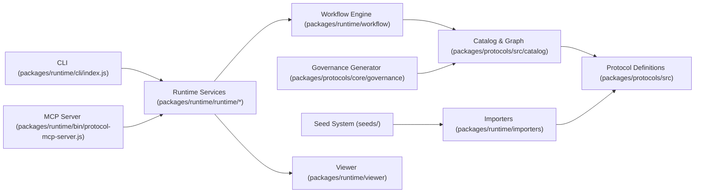

# Mission Completion Report — mission-20251015-153127-839

## Metadata
- Assessment date: 2025-10-16
- Scope: OSS Protocols repository (`/Users/d/portfolio/OSSP-AGI`)
- Prepared for: Strategic roadmap planning and prioritization

## Executive Summary
- The platform delivers a protocol-centric toolchain spanning manifest definitions, catalog graph services, workflow orchestration, and automation interfaces. Core components are implemented in JavaScript with ESM modules and are orchestrated via the CLI and MCP server (`packages/runtime/cli/index.js:36`, `packages/runtime/bin/protocol-mcp-server.js:17`).
- Mission-critical services (Catalog, Workflow state machine, Governance generator) operate on in-memory data structures and file-backed manifests (`packages/protocols/src/catalog/index.js:55`, `packages/runtime/workflow/state-machine.js:11`, `packages/protocols/core/governance/generator.mjs:407`).
- Several high-risk gaps remain: a critical supply-chain vulnerability in `@asyncapi/parser` (`npm audit --json`, see [Security](#security)), a mocked HTTP registry server that prevents real deployment (`packages/runtime/runtime/registry-api.js:282`), stubbed IAM/delegation checks in the agent runtime (`packages/runtime/src/agents/runtime.js:42`), and incomplete viewer APIs returning placeholder payloads (`packages/runtime/viewer/client/src/lib/api.js:105`).
- Operational quality is uneven. Automated performance benchmarks meet budget targets (`packages/runtime/scripts/performance-benchmark.js:8`), but code coverage is 46.30% lines / 38.01% functions / 28.59% branches (parsed from `coverage/lcov.info` on 2025-10-16). Documentation is extensive yet contains outdated claims (README still advertises “480+ tests” while Jest currently enumerates 122 test files; `README.md:153`, `npm test -- --listTests`).
- Infrastructure relies on GitHub Actions CI with layered pipelines (fast guardrail, full validation, Docker build, deflake, security scan) and a production Docker image entrypointing to the MCP server (`.github/workflows/ci.yml:1`, `.github/workflows/security-scan.yml:1`, `Dockerfile:1`), but runtime observability and registry networking are still mocked or TODO’d.

## Architecture Overview



### Component Summary
- **Protocol Definitions & Validators** – 18 manifest types with inline validation utilities (`README.md:15`, `packages/protocols/src/api_protocol_v_1_1_1.js:1`).
- **Catalog Graph Engine** – In-memory multi-index catalog supporting O(1) lookups, dependency traversal, and governance queries (`packages/protocols/src/catalog/index.js:55`).
- **Workflow State Machine & Validators** – Governs draft → approved → deprecated transitions with audit trails (`packages/runtime/workflow/state-machine.js:11`).
- **Runtime Services** – URN resolver, registry API (mock), retry/circuit breaker utilities, metrics wrappers (`packages/runtime/runtime/urn-resolver.js:1`, `packages/runtime/runtime/registry-api.js:282`, `packages/runtime/runtime/circuit-breaker.js:1`).
- **CLI Command Suite** – Dynamic registry-driven command loader powering discovery, validation, governance, workflow, and feedback operations (`packages/runtime/cli/index.js:36`, `packages/runtime/cli/commands/discover.js:8`, `packages/runtime/cli/commands/validate.js:18`, `packages/runtime/cli/commands/governance.js:1`).
- **MCP Server** – Bridges runtime tooling into MCP tool invocations with performance trackers and OpenAPI importer integration (`packages/runtime/bin/protocol-mcp-server.js:17`).
- **Importers** – OpenAPI, AsyncAPI, and Postgres importers with pattern detection and provenance metadata (`packages/runtime/importers/openapi/importer.js:1`, `packages/runtime/cli/commands/discover.js:8`).
- **Seed System** – Curated demo manifests with override bundles for APIs and databases (`seeds/curator.js:33`, `seeds/openapi/stripe/manifest.json:1`, `seeds/databases/northwind/manifest.json:1`).
- **Governance Generator** – Produces multi-section GOVERNANCE.md with diagrams, metrics, and breaking-change analysis (`packages/protocols/core/governance/generator.mjs:407`).
- **Viewer** – React + Express prototype with semantic instrumentation, but several API methods return placeholders awaiting backend integration (`packages/runtime/viewer/client/src/lib/api.js:105`).

## Feature Inventory

| Feature | Category | Description & Evidence | Usage / Metrics |
| --- | --- | --- | --- |
| 18 protocol manifests with embedded validators | Core | Inline schema/validator registry for API manifests and peers (`packages/protocols/src/api_protocol_v_1_1_1.js:97`, `README.md:15`) | 18 protocol modules under `packages/protocols/src` (v1.1.1 family) |
| Catalog index & dependency graph | Core | `URNCatalogIndex` supports URN lookup, secondary indexes, dependency traversal, and agent capability indexes (`packages/protocols/src/catalog/index.js:55`) | Catalog tests cover query/graph behavior (`tests/catalog/index.test.js:1`, 4 dedicated suites) |
| Workflow lifecycle management | Core | State machine enforces draft→approved→deprecated transitions with history tracking (`packages/runtime/workflow/state-machine.js:70`) | Exercised by workflow tests (`tests/workflow/workflow.test.js:1`) |
| Agent runtime & MCP tool bridge | Core | Workflow executor resolves agent nodes and executes tools via MCP or A2A (`packages/runtime/src/agents/runtime.js:31`); MCP server wraps CLI tooling with metrics (`packages/runtime/bin/protocol-mcp-server.js:93`) | `tests/e2e/mcp.e2e.test.ts:1` and 50 MCP latency samples in performance benchmark |
| CLI discovery & validation commands | Supporting | Dynamic command registry loading discover/validate/governance actions (`packages/runtime/cli/index.js:68`, `packages/runtime/cli/commands/discover.js:1`, `packages/runtime/cli/commands/validate.js:18`) | Command folder contains 16 command modules (discover, validate, governance, workflow, seeds, etc.) |
| Importers for OpenAPI / AsyncAPI / Postgres | Supporting | Detects source type, loads specs, infers patterns, attaches provenance (`packages/runtime/cli/commands/discover.js:17`, `packages/runtime/importers/openapi/importer.js:27`) | AsyncAPI importer suite adds binding/PII tests (`tests/importers/asyncapi-bindings.test.js:1`) |
| Seed curator & registry | Supporting | Loads curated manifests, spec files, overrides and orchestrates workspace installation (`seeds/curator.js:33`) | Seeds include Stripe, GitHub, Petstore, Northwind, Sakila (`seeds/openapi/stripe/manifest.json:1`, `seeds/databases/sakila/manifest.json:1`) |
| Governance generator | Supporting | Composes sections (overview, architecture, privacy, breaking changes, events) and enforces policies (`packages/protocols/core/governance/generator.mjs:407`) | Backed by governance tests (`tests/governance/generator.test.js:1`) |
| Performance benchmarking & CI budgets | Supporting | Benchmarks target discovery p95 <1s / MCP p95 <3s / heap <100MB (`packages/runtime/scripts/performance-benchmark.js:8`, `scripts/ci/perf-budget.js:24`) | `npm run test:performance` completed 100 discovery + 50 MCP iterations with PASS summary |
| Registry API server (mock) | Deprecated / Incomplete | `_startHttpServer` implements only a simulated listener, blocking real HTTP deployment (`packages/runtime/runtime/registry-api.js:282`) | Tests target behavior but integration is limited to mocks (`tests/runtime/registry-api.test.js:1`) |
| Viewer backend endpoints | Deprecated / Incomplete | `getValidation` and `getGraph` return hard-coded placeholder responses (`packages/runtime/viewer/client/src/lib/api.js:105`) | Viewer tests marked TODO for backend integration (`packages/runtime/viewer/client/src/lib/api.js:109`) |
| Outdated documentation claims | Deprecated / Incomplete | README still cites “480+ tests” despite current suite enumerating 122 test files (`README.md:153`) | Jest list (`npm test -- --listTests`) produced 122 entries on 2025-10-16 |

## Technical Debt Assessment

| Issue | Severity | Effort | Evidence |
| --- | --- | --- | --- |
| Critical vulnerability in `@asyncapi/parser` via `jsonpath-plus` (RCE) | High | Medium | `npm audit --json` (excerpt in [Security](#security)) identifies CVSS 9.8 vulnerability affecting current version 2.1.2 |
| Registry API server uses mocked HTTP server instead of Express/Fastify | High | Medium | `_startHttpServer` stubs listen/close without actual sockets, preventing production deployment (`packages/runtime/runtime/registry-api.js:282`) |
| Agent runtime delegation and catalog resolution are stubs | High | Medium | Delegation just logs and agent metadata falls back to basic discovery URI (`packages/runtime/src/agents/runtime.js:42`) |
| Viewer APIs return placeholder data, blocking governance/graph UX | Medium | Medium | `getValidation` / `getGraph` intentionally return mock payloads (`packages/runtime/viewer/client/src/lib/api.js:105`) |
| Low automated coverage (46.30% lines / 38.01% functions / 28.59% branches) | Medium | Medium | Coverage parsed from `coverage/lcov.info` (see [Test Coverage & Quality](#test-coverage--quality)) |
| Outdated README metrics misrepresent current test volume | Medium | Low | README “480+ tests” (`README.md:153`) vs Jest enumerated 122 files on 2025-10-16 |
| Mixed ESM/CJS interop adds complexity (dynamic `createRequire`) | Low | Medium | MCP server manually bridges CJS importers (`packages/runtime/bin/protocol-mcp-server.js:27`) |

## Performance & Scalability
- Benchmarks (`npm run test:performance`, 2025-10-16) produced:

```json
{
  "discovery": { "p95": 0.17575000000000074, "compliant": true, "sampleCount": 100 },
  "mcp": { "p95": 969.8821250000001, "compliant": true, "sampleCount": 50 },
  "memory": { "maxHeapMB": 4.906623840332031, "compliant": true },
  "soak": { "duration": 60192, "maxMemoryMB": 5.391487121582031, "iterations": 330, "compliant": true }
}
```

  Source: `npm run test:performance` summary logged by `packages/runtime/scripts/performance-benchmark.js:8`.
- CI enforces the same budgets via `scripts/ci/perf-budget.js:24`, aborting if discovery p95 > 1000 ms or MCP p95 > 3000 ms.
- Performance optimizer and metrics endpoint wrap MCP tools for latency recording (`packages/runtime/bin/protocol-mcp-server.js:37`, `packages/runtime/services/mcp-server/metrics-endpoint.js:1`).
- Runtime load tests rely on mocked URN resolution and cached responses; real external latency is unmeasured due to mocked registry server (`packages/runtime/runtime/registry-api.js:282`).

## Security
- **Dependency vulnerabilities:** `npm audit --json` reported two critical issues in `@asyncapi/parser` (<=3.3.0) caused by `jsonpath-plus` RCE (CVSS 9.8). Remediation requires upgrading to 3.4.0 (semver-major). Audit snippet:

```json
{
  "@asyncapi/parser": {
    "severity": "critical",
    "via": ["jsonpath-plus"],
    "range": "2.0.0-next-major.2 - 3.3.0",
    "fixAvailable": { "version": "3.4.0", "isSemVerMajor": true }
  }
}
```

- **Security automation:** Pull requests touching manifests trigger the security scan workflow, which runs `cli/commands/security-scan.js` and comments on violations (`.github/workflows/security-scan.yml:18`).
- **Runtime controls:** Registry API server pipeline intends to enforce CORS, rate limits, and structured logging, but current implementation mocks HTTP handling, so no real TLS/auth enforcement occurs (`packages/runtime/runtime/registry-api.js:240`).
- **IAM/Delegation:** Agent runtime logs delegation checks but does not validate credentials or enforce policy (`packages/runtime/src/agents/runtime.js:42`).
- **Documentation & policies:** `docs/runtime-security-guide.md:1` and `docs/security/SECURITY_POLICIES.md:1` outline target controls; adherence depends on future implementation.

## Test Coverage & Quality
- Jest enumerated 122 test files as of 2025-10-16 (`npm test -- --listTests`).
- Coverage percentages parsed from `coverage/lcov.info`:

| Metric | Value |
| --- | --- |
| Lines | 46.30% (8888 / 19198) |
| Functions | 38.01% (1724 / 4536) |
| Branches | 28.59% (5960 / 20844) |

- Coverage gaps are concentrated in runtime services and viewer placeholders (numerous TODO scaffolds in `packages/runtime/viewer/client/src/lib/api.js:109` and generated smoke tests under `artifacts/scaffold-smoke/**`).
- E2E suites focus on MCP and workflow integrations (`tests/e2e/openapi-workflow.test.js:1`, `tests/e2e/mcp.e2e.test.ts:1`), but registry/network paths remain mocked.

## Documentation State
- Rich documentation across protocol usage, onboarding, runtime integration, governance, and security (`docs/runtime-integration-guide.md:1`, `docs/runtime-security-guide.md:1`, `docs/governance-generator.md:16`).
- Legacy cleanup tracked under `docs/LEGACY_ARCHIVE.md:1`, reflecting retired protocol versions.
- README overview remains broadly accurate for feature descriptions but overstates test volume and lacks mention of mocked services (`README.md:153`).
- Viewer documentation promises validation/graph panels in “Week 4 integration” but backend endpoints remain TODO (`packages/runtime/viewer/README_VIEWER.md:13`, `packages/runtime/viewer/client/src/lib/api.js:105`).

## Dependency Analysis

| Package | Version | Status | Notes |
| --- | --- | --- | --- |
| ajv | ^8.17.1 | current | JSON schema validation |
| ajv-formats | ^3.0.1 | current | |
| chalk | ^5.6.2 | current | |
| cli-table3 | ^0.6.5 | current | |
| commander | ^11.1.0 | outdated | Latest 14.0.1 |
| cors | ^2.8.5 | current | |
| eventemitter3 | ^5.0.1 | current | |
| express | ^5.1.0 | current | Required but registry server mock prevents full use |
| express-rate-limit | ^8.1.0 | current | |
| fs-extra | ^11.3.2 | current | |
| graphology | ^0.26.0 | current | |
| graphology-traversal | ^0.3.1 | current | |
| inquirer | ^12.9.6 | outdated | Wanted 12.10.0 |
| lru-cache | ^10.4.3 | outdated | Latest 11.2.2 |
| node-fetch | ^3.3.0 | outdated | Latest 3.3.2 |
| ora | ^7.0.1 | outdated | Latest 9.0.0 |
| p-retry | ^5.1.2 | outdated | Latest 7.1.0 |
| pg | ^8.16.3 | current | |
| xmlbuilder2 | ^3.1.1 | outdated | Latest 4.0.0 |
| xxhash-addon | ^2.0.3 | current | |
| @apidevtools/swagger-parser | ^10.0.3 | outdated | Latest 12.1.0 |
| @asyncapi/parser | ^2.1.2 | vulnerable | Critical RCE via jsonpath-plus |
| @babel/core | ^7.28.4 | current | |
| @babel/preset-env | ^7.28.3 | current | |
| @babel/preset-typescript | ^7.27.1 | current | |
| babel-jest | ^29.7.0 | outdated | Latest 30.2.0 |
| jest | ^29.7.0 | outdated | Latest 30.2.0 |
| light-my-request | ^6.6.0 | current | |
| supertest | ^7.1.4 | current | |
| yaml | ^2.8.1 | current | |
| tsx | ^4.15.7 | current | |

## Infrastructure & Deployment
- **CI/CD:** Multi-stage GitHub Actions pipeline (`.github/workflows/ci.yml:1`) covers fast guardrail (test:fast, MCP smoke), full validation (coverage, performance, Docker build), and Docker image smoke tests. Additional workflows handle nightly tests (`.github/workflows/test.yml:1`), runtime integration matrices (`.github/workflows/runtime-integration.yml:1`), deflake reruns, protocol diffs, and security scans.
- **Containerization:** Docker image based on Node 18-alpine runs the MCP server with non-root user and health check probing `/health` (`Dockerfile:1`). Actual health endpoint is not implemented due to mocked registry server (`packages/runtime/runtime/registry-api.js:282`).
- **Performance artifacts:** CI writes `.artifacts/perf.json` and enforces budgets (`scripts/ci/perf-budget.js:24`).
- **Monitoring:** Metrics endpoint collects per-tool latencies but only logs stdout; no external telemetry integration yet (`packages/runtime/services/mcp-server/metrics-endpoint.js:1`).
- **Deployability risks:** Missing real HTTP server & IAM enforcement, plus viewer API placeholders, limit deployment readiness despite Docker packaging.

## Constraints & Data Gaps
- No production telemetry, user analytics, or real registry connectivity were available; registry server remains mocked, so capacity and security characteristics in live environments are unknown.
- Viewer integration is gated on future backend work, leaving UX metrics and governance visualizations unmeasured.
- README and docs cite historical coverage/performance statistics; current metrics differ materially (coverage 46%, 122 Jest test files).

---

Prepared as an objective current-state assessment. No remediation plan is provided pending prioritization guidance.
